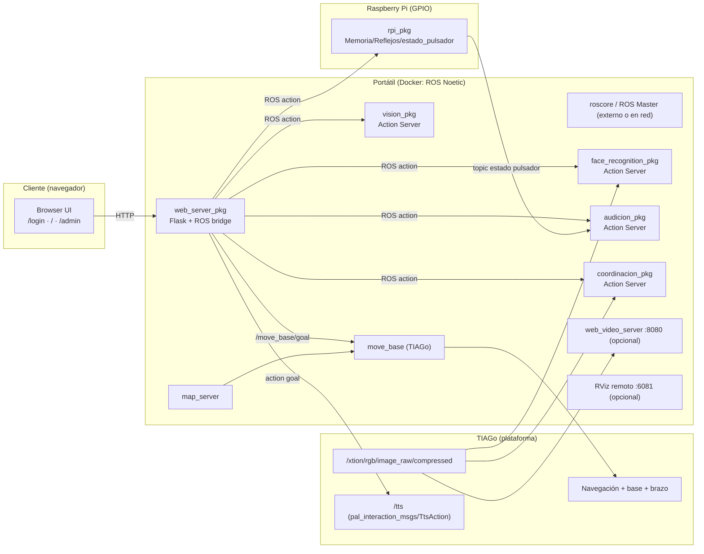

# Psicotécnico con TIAGo + Raspberry Pi (ROS Noetic)

Sistema **asistido por robot** para ejecutar una **batería de pruebas psicotécnicas** mediante una interfaz web, coordinando varios **Action Servers ROS** y un módulo físico con **Raspberry Pi** (botonera/LEDs/buzzer/LCD).

> ⚠️ Proyecto académico y **prototipo**. No es un producto sanitario ni sustituye evaluación clínica profesional.

---

## Qué hace este proyecto

El objetivo es automatizar y unificar varias pruebas psicotécnicas en una única experiencia:

- El paciente interactúa con:
  - **TIAGo** (voz/TTS, cámara RGB, navegación, movimientos del brazo en la prueba de visión).
  - Una **botonera física** (Raspberry Pi) para pruebas de **memoria** y **reflejos**, y como input en **audición**.
- El operador controla todo desde una **interfaz web** (Flask) con:
  - **Login** (opcionalmente con reconocimiento facial).
  - Lanzador de pruebas (en orden configurable).
  - Panel de **administración** con **vídeo**/diagnóstico.
  - Generación de **informe PDF** y guardado de histórico (CSV).

---

## Pruebas incluidas

1) **Login por cara (opcional)**
- Reconocimiento facial con **DeepFace** (modelo típico: ArcFace) a partir de la cámara RGB del robot.
- Base de embeddings en `embeddings_db.json`.

2) **Memoria (Raspberry Pi)**
- El sistema enciende una **secuencia de LEDs** (asociados a pulsadores).
- El paciente debe repetir la secuencia; la dificultad aumenta por niveles.

3) **Reflejos (Raspberry Pi)**
- Se enciende un **único pulsador** de forma aleatoria.
- El paciente debe pulsar lo más rápido posible; el tiempo se reduce según el nivel.

4) **Audición (Robot + Raspberry Pi)**
- Prueba de dos partes:
  - **Parte 1**: pulsar el botón (típicamente el **#6**) cuando se escucha un bip.
  - **Parte 2**: contar mentalmente una serie de bips e introducir el conteo.
- El servidor puede usar el **topic de estado del pulsador** publicado por la Raspberry.

5) **Coordinación / Movilidad (cámara + MediaPipe)**
- Análisis de **marcha y postura** con **MediaPipe** (pose estimation) sobre la cámara RGB.
- Se calculan métricas y una nota final (según implementación del `coordinacion_pkg`).

6) **Visión (navegación + brazo)**
- El robot se posiciona en distintos puntos (p.ej. *cerca/lejos*), muestra un cuaderno y el paciente lee frases.
- Se devuelve/valida el contenido leído mediante la UI (según flujo configurado en `vision_pkg` + `web_server_pkg`).

---

## Arquitectura (visión general)

- **Portátil/PC (Docker)**: ejecuta el workspace ROS `psico_ws` (webserver + action servers principales).
- **TIAGo**: aporta cámara, navegación, y TTS (`/tts`).
- **Raspberry Pi (nativo, sin Docker)**: ejecuta `rpi_pkg` para GPIO (LEDs/pulsadores/buzzer/LCD).

> En este proyecto, Docker se usa **solo en PC/TIAGo** como entorno reproducible. En la Raspberry se instala ROS Noetic de forma **nativa** para asegurar baja latencia y acceso fiable a GPIO.

### Diagrama (Mermaid)



---

## Interfaz ROS (resumen)

Este repositorio se basa en **ROS Actions** para encapsular cada prueba como una “tarea” con `goal → feedback → result`.

Ejemplos de interfaces (pueden variar según versión del paquete):

- **Cámara**: `/xtion/rgb/image_raw/compressed` (suscriptores: face recognition / movilidad / streaming)
- **TTS**: `/tts` (`pal_interaction_msgs/TtsAction`)
- **Navegación**: `/move_base/goal` (`move_base_msgs/MoveBaseActionGoal`), y lectura de pose (AMCL/robot_pose) para saber si se ha detenido.
- **Raspberry**: un topic de “estado de pulsador” publicado por `rpi_pkg/estado_pulsador.py` (usado, por ejemplo, en audición).

---

## Estructura del repositorio

```text
psicotecnico/
├─ README.md
├─ Dockerfile
├─ docker-compose.yml
├─ requirements_docker.txt
├─ requirements_rpi.txt
├─ tutorial_docker.txt
└─ carpeta_compartida/
   ├─ setup_env.sh
   └─ psico_ws/
      └─ src/
         ├─ audicion_pkg/
         ├─ coordinacion_pkg/
         ├─ face_recognition_pkg/
         ├─ mover_pkg/
         ├─ rpi_pkg/
         ├─ vision_pkg/
         └─ web_server_pkg/
```

---

## Requisitos

### Hardware
- **TIAGo** (con stack ROS operativo, cámara RGB, navegación, y `/tts` disponible).
- **Raspberry Pi** (p.ej. 3B) conectada a una botonera con LEDs/pulsadores/buzzer/LCD (según montaje del equipo).
- Red LAN/Wi‑Fi común (PC ↔ TIAGo ↔ Raspberry).

### Software (recomendado)
- **Docker + Docker Compose** en el portátil/PC.
- **Ubuntu 20.04 + ROS Noetic nativo** en la Raspberry Pi (sin Docker).
- Dependencias Python:
  - PC/Docker: ver `requirements_docker.txt`
  - Raspberry: ver `requirements_rpi.txt`

---

## Puesta en marcha (Quickstart)

> **Idea clave:** el stack completo se levanta desde el **Docker del PC**, salvo el `rpi_pkg` que se ejecuta **en la Raspberry**.

### 1) Clonar el repositorio

```bash
git clone https://github.com/11ander/psicotecnico.git
cd psicotecnico
```

### 2) Arrancar Docker (PC)

Sigue `tutorial_docker.txt`. En general:

```bash
docker compose up --build -d
docker compose exec <NOMBRE_DEL_SERVICIO> bash
```

> El `docker-compose.yml` usa `network_mode: host` para que ROS funcione en red sin mapeos de puertos.

Dentro del contenedor, la `.bashrc` suele dejar el entorno listo (source del `setup_env.sh`). Si no:

```bash
source /opt/ros/noetic/setup.bash
source /carpeta_compartida/setup_env.sh
```

### 3) Compilar el workspace (PC/Docker)

```bash
cd /carpeta_compartida/psico_ws
catkin build
source devel/setup.bash
```

### 4) ROS Master / roscore

El script de arranque comprueba que existe ROS Master accesible (con `rosnode list`).
Asegúrate de tener **roscore** corriendo (en TIAGo o en una máquina de la red) **antes** de lanzar el stack.

Ejemplo (si lo lanzas tú mismo en otra terminal del contenedor):

```bash
roscore
```

### 5) Levantar el stack completo (PC/Docker)

```bash
cd /carpeta_compartida/psico_ws
chmod +x start_psico_stack.sh
./start_psico_stack.sh
```

Este script:
- Arranca RViz remoto (noVNC), `map_server`, set initial pose, y lanza los Action Servers + el webserver.
- Gestiona logs en `psico_ws/logs/bringup/`
- Se detiene con `Ctrl+C` (limpia procesos y roslaunch).

#### Flags útiles

```bash
NO_LOGIN=true   ./start_psico_stack.sh   # saltar login por cara
MUTE=true       ./start_psico_stack.sh   # silenciar TTS
NO_TEST=true    ./start_psico_stack.sh   # modo sin pruebas reales (según implementación)
DB_PATH="package://face_recognition_pkg/src/face_recognition_pkg/embeddings_db.json" ./start_psico_stack.sh
```

> También soporta túnel opcional (p.ej. Pinggy) mediante `PINGGY_ENABLE` y `PINGGY_SSH_TARGET`.

### 6) Ejecutar la Raspberry Pi (en paralelo)

En la **Raspberry** (Ubuntu 20.04 + ROS Noetic nativo):

1) Clona el repo (o copia `carpeta_compartida/psico_ws`).
2) Instala deps Python:

```bash
pip3 install -r requirements_rpi.txt
```

3) Compila el workspace y ejecuta los nodos de `rpi_pkg` (según tu flujo; puede ser con launch o con rosrun):

```bash
rosrun rpi_pkg servidor_memoria.py
rosrun rpi_pkg servidor_reflejos.py
rosrun rpi_pkg estado_pulsador.py
```

> La Raspberry debe apuntar al mismo `ROS_MASTER_URI` que el resto del sistema.

---

## Uso (desde la web)

- Abre la interfaz:
  - `http://localhost:5000` (típicamente dentro de la red/host donde corre el contenedor)
- Flujo típico:
  1) Login (o bypass con `NO_LOGIN=true`).
  2) Selección y ejecución de pruebas en orden.
  3) Panel admin (diagnóstico, streaming, etc. según configuración).
  4) Generación de informe y guardado en histórico (CSV).

---

## Paquetes principales (resumen)

- `web_server_pkg`  
  Orquestador del sistema (Flask + clientes de acción). Gestiona UI, estado de sesión, histórico `history.csv`, y reporte PDF.

- `face_recognition_pkg`  
  Reconocimiento facial (DeepFace + OpenCV) como Action Server para login.

- `audicion_pkg`  
  Prueba de audición (bips, reacción y conteo), integra TTS y el estado del pulsador de la Raspberry.

- `coordinacion_pkg`  
  Prueba de movilidad/marcha/postura (MediaPipe + cámara), genera métricas y nota.

- `vision_pkg`  
  Secuencia de prueba visual con navegación y brazo (mostrar cuaderno, tiempos de lectura, etc.).

- `mover_pkg`  
  Utilidades de navegación/visualización (mapas, RViz, helpers y checkpoints).

- `rpi_pkg` (Raspberry Pi)  
  Interfaz con GPIO para LEDs/pulsadores/buzzer/LCD y Action Servers para Memoria/Reflejos.

---

## Demo (vídeo)

[](https://www.youtube.com/watch?v=g4rVxneSf24)

---

## Troubleshooting rápido

- **El script dice que no hay roscore**  
  Asegura `ROS_MASTER_URI` correcto y que el ROS Master está levantado y accesible desde el contenedor (misma red).

- **No aparece vídeo / cámara**  
  Verifica que TIAGo publica `/xtion/rgb/image_raw/compressed` y que `web_video_server` está en marcha (si lo usas).

- **Raspberry no “responde”**  
  Comprueba:
  - `ROS_MASTER_URI` / `ROS_IP` en la Raspberry
  - firewall/red
  - que `rpi_pkg` está corriendo (y permisos GPIO correctos)

- **Se cae un roslaunch**  
  Revisa logs en `carpeta_compartida/psico_ws/logs/bringup/`.

---

## Créditos y documentación adicional

- Documentación extensa del hito: `Hito 2/README.md`
- Readmes por paquete (si existen) dentro de cada `psico_ws/src/<paquete>/`

---

## Licencia

No se especifica licencia en este repositorio. Si vas a reutilizar el código fuera del contexto académico, revisa con los autores.
