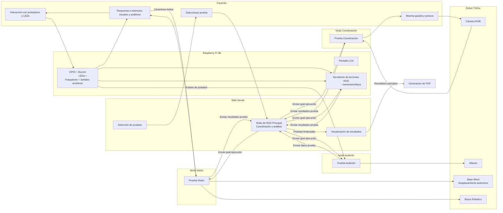
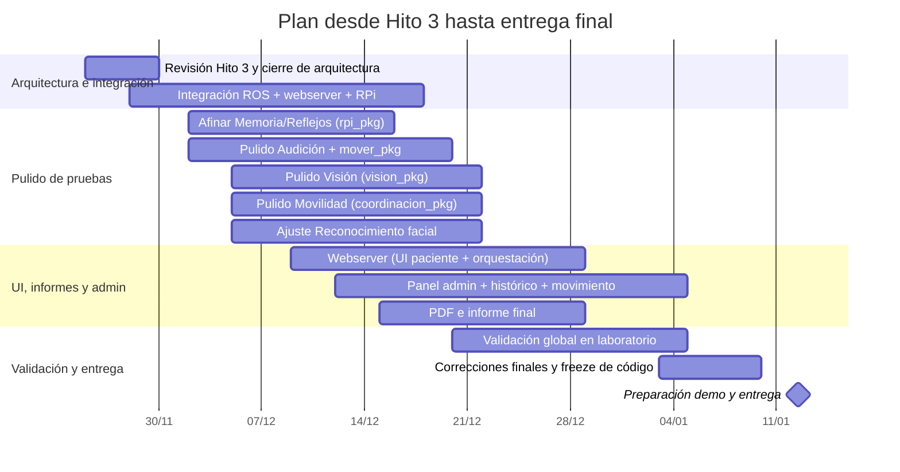
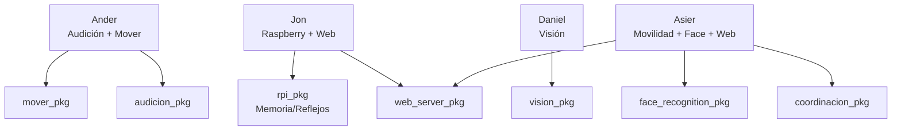

# Hito 2 – Diseño Conceptual del Sistema Robótico  
**Asignatura:** Robótica Aplicada a Servicios Biomédicos  
**Curso:** 2025–2026  
**Equipo:** PSICOTECNICO  
**Integrantes:**  
- Jon Camiruaga
- Daniel Gutierrez
- Ander Perez
- Asier Burgos

---

> **Índice**

- [1. Resumen del problema biomedico](#1-resumen-del-problema-biomedico)  
  - [1.1) Ámbito de evaluación](#11-ámbito-de-evaluación)  
  - [1.2) Descripción general del sistema](#12-descripción-general-del-sistema)  
  - [1.3) Justificación y valor biomédico](#13-justificación-y-valor-biomédico)  
  - [1.4) Requisitos funcionales](#14-requisitos-funcionales)  
  - [1.5) Capacidades técnicas](#15-capacidades-técnicas)  
  - [1.6) Resultado esperado](#16-resultado-esperado)  
- [2. Arquitectura del sistema](#2-arquitectura-del-sistema)  
  - [2.a) Diagrama general del sistema](#2a-diagrama-general-del-sistema-y-descripción-de-los-principales-módulos-funcionales)
  - [2.b) Especificación de componentes de hardware](#2b-especificación-de-componentes-de-hardware)  
  - [2.c) Esquema preliminar de interfaz de usuario (UIUX) y flujo de interacción con el sistema](#2c-esquema-preliminar-de-interfaz-de-usuario-uiux-y-flujo-de-interacción-con-el-sistema)  
- [3. Diseño de software y comunicación](#3-diseño-de-software-y-comunicación)  
  - [3.a) Arquitectura de nodos en ROS 1](#3a-arquitectura-de-nodos-en-ros-1-diagrama-de-topics-servicios-y-acciones)  
  - [3.b) Estructura del repositorio y principales packages o módulos](#3b-estructura-del-repositorio-y-principales-packages-o-módulos)  
  - [3.c) Descripción de posibles contenedores Docker y dependencias del entorno](#3c-descripción-de-posibles-contenedores-docker-y-dependencias-del-entorno)  
- [4. Análisis de viabilidad técnica](#4-análisis-de-viabilidad-técnica)  
  - [4.a) Identificación de posibles limitaciones técnicas](#4a-identificación-de-posibles-limitaciones-técnicas-alcance-precisión-tiempo-de-respuesta-compatibilidad)  
  - [4.b) Estrategia de mitigación y pruebas iniciales](#4b-estrategia-de-mitigación-y-pruebas-iniciales)  
- [5. Cronograma de desarrollo](#5-cronograma-de-desarrollo)  
  - [5.a) Plan temporal desde el Hito 3 hasta la entrega final](#5a-plan-temporal-desde-el-hito-3-hasta-la-entrega-final)  
  - [5.b) Reparto de responsabilidades actualizado](#5b-reparto-de-responsabilidades-actualizado-con-enfoque-colaborativo)  

---


## 1. Resumen del problema biomedico

> **Objetivo:** diseñar un sistema robótico con TIAGo que realice de forma automatizada una evaluación psicotécnica de capacidades sensoriales y motrices en un entorno clínico (similar a las pruebas para el carnet de conducir), generando un informe estandarizado a partir de datos objetivos.
> El sistema está orientado a la evaluación de personas que deben someterse a pruebas psicotécnicas, como aspirantes o renovadores del carnet de conducir, evaluaciones básicas de capacidades sensoriales o revisiones realizadas en centros autorizados.

### 1.1. Ámbito de evaluación
- Vista
- Oído
- Movimiento y coordinación
- Velocidad de reflejos
- Memoria a corto plazo

### 1.2. Descripción general del sistema
- **Rol de TIAGo**  
  Facilita y orquesta la sesión: presenta instrucciones por voz, guía al paciente y captura vídeo para prueba de coordinación.
- **Unidad auxiliar (Raspberry Pi 3B)**  
  Gestiona **pulsadores, LEDs, buzzer y pantalla LCD** para pruebas de **reflejos** y **memoria**.
- **Flujo básico**  
  El robot guía al paciente → se ejecutan las pruebas → se registran y procesan los datos → se genera un informe con resultados y métricas clave.
- **Restricción relevante**  
  Las pruebas de reflejos y memoria dependen de sensórica externa en la Raspberry Pi (TIAGo no dispone de esos periféricos de serie).

### 1.3. Justificación y valor biomédico
- **Precisión y estandarización**: protocolos reproducibles con control milimétrico del *timing* y registro automático.
- **Menor carga asistencial**: libera tiempo del personal sanitario para tareas de mayor valor.
- **Reducción de errores**: minimiza variabilidad inter-evaluador y sesgos humanos.
- **Mejor experiencia del paciente**: interacción guiada, consistente y potencialmente menos estresante.

> **Campo emergente**: la robótica clínica se ha centrado históricamente en rehabilitación/asistencia; su aplicación a evaluaciones psicotécnicas automatizadas aporta innovación y trazabilidad objetiva.

---

### 1.4. Requisitos funcionales

| Módulo | Descripción | Detalles operativos |
|---|---|---|
| **Test de Reflejos** | Pulsación de botón iluminado | Secuencias aleatorias, niveles crecientes (menos tiempo de respuesta)|
| **Test de Memoria (corto plazo)** | Repetición de secuencias de LEDs | Secuencias aleatorias, niveles crecientes (secuencias cada vez mas largas) |
| **Prueba de Vista** | Estímulos visuales | Presentación en pantalla/tabla; Diagnostico capacidad visual del paciente |
| **Prueba de Oído** | Estímulos auditivos (beeps) | Pitidos aleatorios en número y tiempo, respuesta del usuario |
| **Evaluación psicomotora** | Marcha y postura con cámara de TIAGo | Detección de desviaciones/cambios bruscos |
| **Interfaz gráfica** | Selección de pruebas y visualización de resultados | Facilita el feedback de ciertas pruebas del psicotecnico |

---

### 1.5. Capacidades técnicas

**Hardware**
- **Robot TIAGo**: base movil, cámara, altavoz y brazo robótico.
- **Raspberry Pi 3B**: panel de **pulsadores + LEDs**, **buzzer**, **Pantalla LCD** y conexión **I2C**/**GPIO** para estímulos y lectura de respuestas.

**Software**
- **ROS 1 Noetic** para comunicación y orquestación de nodos (TIAGo ↔ Raspberry Pi).
- **Python** para lógica de pruebas, manejo de GPIOs...
- **Visión por computador**: uso de OpenCV para análisis de postura y marcha.

---

### 1.6. Resultado esperado
- **Sesión guiada de pruebas** totalmente automatizada.
- **Métricas objetivas** por prueba (precisión, aciertos/fallos, estabilidad postural).
- **Informe estandarizado** con resultados y observaciones, listo para incorporar a historia clínica. Además del informe estandarizado, los resultados permiten orientar decisiones clínicas básicas. Más allá del apto / no apto, el sistema puede sugerir recomendaciones como la necesidad de una revisión oftalmológica.

## 2. Arquitectura del sistema

### 2.a) Diagrama general del sistema y descripción de los principales módulos funcionales
#### Diagrama general del sistema





#### Descripción de los principales módulos funcionales

### Paquete `rpi_pkg`

Este paquete agrupa todas las funcionalidades que se ejecutan de forma externa en la **Raspberry Pi 3B**. Su propósito principal es gestionar y ejecutar las pruebas psicotécnicas de reflejos y memoria a corto plazo.

**Arquitectura de Control:**
> La lógica de las pruebas (scripts de Python) reside en la Raspberry Pi. Un servidor de acciones ROS (`servidor_memoria.py`) se ejecuta en la Pi y espera peticiones. Desde el `web_server` principal, el usuario selecciona las pruebas a realizar. El `web_server` envía un *goal* (objetivo) al servidor de acciones, indicando qué pruebas ejecutar y en qué orden. El servidor de acciones se encarga de lanzar los scripts correspondientes (`reflejos.py`, etc.) cuando llega su turno.

---

###### 1. Prueba de Reflejos

**Script:** `reflejos.py`

**Descripción Funcional:**
Esta prueba evalúa la capacidad de reacción del paciente.

* **Estímulo:** El sistema enciende LEDs en pulsadores distribuidos de forma aleatoria.
* **Acción:** El paciente debe pulsar el botón correspondiente al LED que se ha encendido.
* **Evaluación:** Se mide la precisión de la respuesta.
* **Niveles:** Cuando el paciente supera un nivel, avanza al siguiente. En cada nuevo nivel, la velocidad a la que se encienden los LEDs es mayor, incrementando la dificultad.

**Implementación:**
* Este script es invocado por el servidor de acciones `servidor_memoria.py` cuando recibe la orden correspondiente desde el `web_server`.

---

###### 2. Prueba de Memoria a Corto Plazo

**Script:** 'memoria.py'

**Descripción Funcional:**
Esta prueba evalúa la capacidad de memoria a corto plazo del paciente.

* **Estímulo:** El sistema presenta una secuencia de LEDs que se encienden y apagan, uno tras otro, de forma aleatoria.
* **Acción:** El paciente debe repetir la secuencia, pulsando los botones en el mismo orden exacto en que se encendieron.
* **Evaluación:** El sistema valida si la secuencia introducida por el paciente es correcta.
* **Niveles:** Al superar un nivel, el paciente avanza al siguiente. En cada nuevo nivel, se añade un LED adicional a la secuencia, incrementando progresivamente la dificultad.

**Implementación:**
* Al igual que la prueba de reflejos, esta funcionalidad es gestionada e invocada por el servidor de acciones `servidor_memoria.py`.

---

###### 3. Utilería: Estado de Pulsador

**Script:** `estado_pulsador.py`

**Descripción:**
Este script no es una prueba psicotécnica, sino un nodo de utilidad que se ejecuta de forma independiente para dar soporte a *otros* módulos (como el módulo de audición).

* **Función:** Publica de forma constante en un *topic* de ROS el estado (pulsado/no pulsado) de un pulsador específico de la Raspberry Pi.
* **Caso de Uso:** Se utiliza en una de las pruebas del módulo de audición. En dicha prueba, el paciente debe presionar este pulsador específico en el momento en que escucha un pitido emitido por el robot TIAGO.
* **Ayuda Visual:** Para que el usuario pueda identificar fácilmente cuál de los 6 pulsadores de la Raspberry Pi debe utilizar para la prueba de audición, el LED asociado a ese pulsador se programa para que permanezca iluminado de forma fija durante toda la duración de esa prueba.

---

### Paquete `audicion_pkg`

Este paquete agrupa las funcionalidades relacionadas con la evaluación de la capacidad auditiva del paciente. A diferencia del paquete rpi_pkg, que gestiona LEDs y pulsadores para reflejos y memoria, este módulo coordina los pitidos generados por el TIAGo y la detección de pulsaciones de un pulsador recogidas desde la Raspberry Pi mediante el script estado_pulsador.py.

Su función principal es sincronizar estímulos acústicos emitidos por el robot con la respuesta física del usuario, registrando los tiempos de reacción y validando si la percepción auditiva es correcta.

**Arquitectura de Control:**
> El paquete audicion_pkg implementa un action server de ROS 1 que se ejecuta desde un ordenador central (script audicion_action.py). Este servidor hace uso de la información publicada por un nodo auxiliar en la Raspberry Pi, encargado de enviar continuamente el estado de un pulsador específico.
> El web_server actúa como cliente de acciones, enviando un goal al action server para iniciar la prueba de audición. El goal únicamente indica que debe ejecutarse la prueba completa (ambas subpruebas), mientras que el servidor se encarga de toda la ejecución interna.
> El servidor ejecuta una clase que implementa dos subpruebas auditivas diferentes (conteo de pitidos y tiempo de reaccion auditivo)
> Una vez finalizadas ambas subpruebas, el action server envía un result al nodo central (web server). Este resultado no es todavía la evaluación final, porque parte del análisis depende de una acción posterior del usuario.

---

###### 1. Subprueba 1 de audicion -- Conteo de pitidos

**Script:** integrado en el script 'prueba_audicion.py'
**Scripts auxiliares:** 'speaker.py'

**Descripción Funcional:**
Esta prueba evalúa la percepción auditiva básica y la capacidad de discriminación de estímulos, mediante el conteo de un número determinado de pitidos.

* **Estímulo:** El TIAGo genera una secuencia de pitidos con variación aleatoria tanto en el intervalo entre pitidos como en la cantidad total. El número real de pitidos es conocido por el sistema pero no por el usuario.
* **Acción:** Una vez finalizada, desde el web server, el usuario indica cuántos pitidos cree haber escuchado.
* **Evaluación:** El sistema registra el número total de pitidos emitidos, y luego lo envia junto a los datos de la otra subprueba al web server, para que este sea quien genere el resultado con la acción del usuario.

**Implementación:**
* 'audicion_action.py' registra cuántos pitidos se han de emitir, y manda al TIAGo a realizarlos mediante el la clase creada en el script 'speaker.py'.

---

###### 2. Subprueba 2 de audicion -- Tiempo de Reacción ante estimulos auditivos

**Script:** 'prueba2.py'
**Scripts auxiliares:** 'speaker.py'

**Descripción Funcional:**
Esta prueba evalúa el tiempo de reacción auditivo del usuario cuando se generan pitidos desde el altavoz del TIAGo.

* **Estímulo:** Pitidos emitidos mediante la ayuda del script 'speaker.py' a intervalos controlados o aleatorios.
* **Acción:** El usuario debe pulsar el botón iluminado en la Raspberry Pi en el momento en que escucha el pitido.
* **Evaluación:** El sistema registra si se pulsa el pulsador en todo momento, y permite registrar el número de aciertos (pulsación desde  que suena el pitido hasta 1 segundo despues) y el número de fallos debidos a una acción del usuario sin que haya habido pitido. Todo esto se envia al nodo central cuando finalize toda la prueba de audición.

**Implementación:**
* 'prueba2.py' registra cuántos pitidos se han de emitir, y manda al TIAGo a realizarlos mediante el la clase creada en el script 'speaker.py'. La coordinación completa de la prueba corresponde a prueba_audicion.py, que ejecuta esta subprueba cuando el web_server lo solicita y recoge sus resultados.

---

### Paquete `face_recognition_pkg`

Este paquete implementa el **módulo de reconocimiento facial** del sistema. Su objetivo es identificar al paciente antes o durante la sesión, asociando la evaluación psicotécnica a una persona concreta.

**Función dentro del sistema**

- Permite **enrolar** usuarios (crear su huella facial) y **reconocerlos** en tiempo real usando la cámara RGB de TIAGo.
- Expone un **Action Server ROS** (`face_recognition_action`) que puede ser llamado desde el `web_server_pkg` u otros nodos para:
  - Iniciar el reconocimiento.
  - Esperar a que la identidad sea estable.
  - Devolver el nombre del paciente reconocido.

**Arquitectura básica**

- Suscripción al topic de cámara:
  - `RosImageSource` recibe imágenes desde `/xtion/rgb/image_raw/compressed` (`sensor_msgs/CompressedImage`) y mantiene siempre el **último frame en BGR** para procesarlo.
- Inferencia con DeepFace:
  - Modelo: `ArcFace`.
  - Detector: `opencv` (configurable).
  - A partir de cada frame se calcula un **embedding** normalizado del rostro.
  - Se compara contra una base de embeddings en disco (`embeddings_db.json`) usando **distancia coseno** y un umbral de similitud.
- Estabilización:
  - Se mantiene una **ventana deslizante** con las últimas predicciones.
  - Solo cuando una misma identidad gana por mayoría durante varios frames, el servidor considera la identidad como **estable** y devuelve el resultado.

**Scripts principales**

- `recognize_action_server.py`  
  - Nodo ROS que levanta el **Action Server** `face_recognition_action`.
  - *Goal*: campo `ejecutar` (bool). Si `ejecutar = False`, aborta sin hacer nada.
  - *Result*:
    - `nombre`: nombre del usuario reconocido o `"Desconocido"` si no se alcanza un match fiable.
  - Hilos:
    - Hilo principal: gestiona la acción ROS, la ventana de estabilización y la interfaz gráfica opcional (ventana OpenCV con el vídeo y la etiqueta del nombre).
    - Hilo worker: procesa el último frame disponible, calcula el embedding con DeepFace y actualiza la predicción más reciente.

- `enroll_user.py`  
  - Script **offline** para **registrar nuevos usuarios** en la base de datos de embeddings (`embeddings_db.json`).
  - Flujo:
    - Pide por consola el **nombre del usuario**.
    - Abre la cámara local y guía al usuario por varias **poses simples** (frente, giro ligero, etc.).
    - Para cada pose:
      - Captura varios frames.
      - Selecciona el **más nítido** (métrica de Laplaciano).
      - Extrae el embedding con DeepFace.
    - Calcula la **media de todos los embeddings**, la normaliza y:
      - Si el usuario ya existe, actualiza su plantilla promediando con la anterior.
      - Si no existe, crea una nueva entrada en el JSON.

**Otros ficheros relevantes**

- `cliente_action_face.py`: cliente de acción ROS para probar el servidor de reconocimiento facial.
- `recognize.py`, `recognize_ros.py`: scripts auxiliares para pruebas de reconocimiento (modo standalone / ROS).
- `embeddings_db.json`: base de datos de usuarios y sus vectores de embedding.
- `requirements*.txt`: dependencias específicas de Python (DeepFace, OpenCV, etc.).

---

### Paquete `coordinacion_pkg`

Este paquete implementa la **prueba de movilidad y coordinación** del paciente, utilizando la cámara RGB de TIAGo y un modelo de pose (MediaPipe) para analizar la marcha y la postura durante un intervalo de tiempo.

**Función dentro del sistema**

- Evalúa de forma automática:
  - **Rectitud del tronco** (inclinación lateral y flexión anterior).
  - **Trayectoria** (zigzag / desviaciones laterales durante la marcha).
  - **Simetría de la marcha** (posible cojera, diferencias entre ambas piernas).
- Devuelve una **puntuación global (0–100)** y un **informe textual** con interpretación cualitativa, integrable en el informe final del psicotécnico.

**Arquitectura básica**

- Suscripción al topic de cámara:
  - `RosImageSource` escucha el topic RGB (`/xtion/rgb/image_raw/compressed`) y mantiene el último frame disponible.
- Estimación de pose:
  - Usa **MediaPipe Pose** para obtener landmarks del cuerpo (hombros, caderas, tobillos, etc.).
  - Filtra por **visibilidad mínima** para evitar mediciones con detecciones poco fiables.
- Ventanas temporales:
  - Estructuras `RollingWindow` acumulan valores durante varios segundos para calcular:
    - Inclinación lateral y pitch del tronco.
    - Evolución de la posición de la cadera (zigzag).
    - Altura de los tobillos para detectar el ciclo de marcha y asimetrías.
- Métricas y scoring:
  - Cada métrica (tronco, zigzag, cojera) se transforma en un **score parcial (0–1)** con rangos “normal / máximo aceptable”.
  - La nota final es una combinación ponderada de esos scores, escalada a 0–100.
  - Se generan textos cualitativos (por ejemplo: “zigzag acusado; posible alteración del equilibrio”).

**Scripts principales**

- `mobility_exam_action_server.py`  
  - Nodo principal del paquete: levanta el **Action Server** `mobility_exam_action`.
  - **Parámetros ROS** (ejemplos):
    - `~topic`: topic de cámara a usar.
    - `~compressed`: indica si se usan `CompressedImage` o `Image`.
    - `~complexity`: complejidad del modelo de MediaPipe.
    - `~out_dir`: carpeta donde guardar métricas e informe.
    - `~enable_ui`: activar/desactivar ventana gráfica.
  - **Goal de la acción**:
    - Campo `ejecutar` (bool). Si `ejecutar = False`, aborta la acción.
  - **Result**:
    - `score`: nota global de movilidad (0–100).
    - `informe`: lista de líneas de texto con la interpretación del resultado.
    - `report_path`: ruta del informe de texto generado (`.txt`).
    - `csv_path`: ruta del fichero CSV con métricas por segundo.
  - Comportamiento:
    - Mientras la persona está correctamente encuadrada (ni demasiado cerca ni demasiado lejos), el tiempo se cuenta como **“válido”**.
    - La prueba termina al alcanzar un tiempo válido objetivo (p.ej. 30 s).
    - Durante la ejecución:
      - Publica feedback (`estado`, `valid_elapsed`) para monitorizar el estado desde el webserver o consola.
      - En modo UI, muestra una ventana con la pose dibujada, texto de estado y tiempo acumulado.

- `cliente_action_mobility.py`  
  - Cliente de acción para probar `mobility_exam_action`.
  - Permite lanzar la prueba de movilidad desde consola, ver feedback y el resultado final sin pasar por el webserver.

- `speak_api.py`  
  - Módulo auxiliar para hacer hablar a TIAGo a través del action `/tts` (`pal_interaction_msgs/TtsAction`).
  - Clase `TiagoSpeaker`:
    - Crea un `SimpleActionClient` a `/tts`.
    - Métodos principales:
      - `speak(text, lang_id="es_ES")`: bloqueante; espera a que termine la locución.
      - `speak_async(text, lang_id="es_ES")`: envía el texto sin bloquear.
  - Uso previsto: integrar mensajes de voz de TIAGo (instrucciones y feedback) durante la prueba de movilidad o en el flujo general del psicotécnico.

**Otros ficheros relevantes**

- `mobility_exam.py`, `mobility_exam_30s.py`: pruebas de la lógica de movilidad sin acción ROS.
- `holistic_cam.py`, `holistic_ros_cam.py`: pruebas con la cámara y MediaPipe (captura local / ROS).
- Ficheros `mobility_metrics_*.csv` y `mobility_report_*.txt`: ejemplos de resultados generados por el servidor en ejecuciones anteriores.

---

### Unidad de interfaz web (web_server_pkg)

Aunque el `web_server_pkg` es principalmente software, su despliegue se apoya en una pequeña infraestructura hardware que permite que la interfaz gráfica sea accesible desde la red del laboratorio.

**Servidor web**

El servidor que ejecuta el `web_server_pkg` puede ser:

- Un **PC del laboratorio** conectado a la misma red que TIAGo.
- O bien el propio **PC interno de TIAGo**, ejecutando el workspace de ROS 1 y el servidor Flask.

Requisitos aproximados:

- CPU: 4 núcleos (Intel i5/i7 equivalente).
- RAM: ≥ 8 GB.
- Almacenamiento: ≥ 50 GB (para logs, históricos y dependencias).
- Conectividad: Ethernet recomendada para baja latencia con el resto de nodos ROS.

En este equipo se ejecutan:

- ROS 1 (Noetic) con el workspace `psico_ws`.
- El nodo Flask de `web_server_pkg` (servidor HTTP).
- `rosbridge_server` (puente WebSocket ↔ ROS) para la parte de mapa y visualización.
- `web_video_server` para publicar el stream de la cámara de TIAGo a través de HTTP.

**Dispositivos cliente**

El acceso a la interfaz gráfica se realiza desde dispositivos estándar con navegador web:

| Dispositivo       | Uso principal                                      | Requisitos mínimos                            |
|-------------------|----------------------------------------------------|-----------------------------------------------|
| Tablet / iPad     | Panel de control en la sala de pruebas             | Pantalla ≥ 10", navegador moderno (Chrome/FF) |
| Portátil del técnico | Supervisión avanzada (panel admin + mapa 2D)  | Conectividad WiFi/Ethernet al servidor web    |
| PC de consulta    | Revisar informes PDF e histórico de sesiones       | Cualquier PC con navegador actual             |

Los clientes sólo necesitan:

- Estar en la misma **LAN** que el servidor web.
- Acceder a la URL del servidor (ej. `http://<servidor>:5000/`).

**Red y comunicación**

La unidad de interfaz web se integra en la red del laboratorio junto con TIAGo y la Raspberry Pi:

- **LAN cableada**:
  - Conexión entre TIAGo y el servidor web para los topics y actions de ROS 1.
- **WiFi**:
  - Acceso de tablets y portátiles al servidor web.
- El servidor web actúa como **punto central**:
  - Desde el navegador se hacen peticiones HTTP → `web_server_pkg`.
  - `web_server_pkg` se comunica con:
    - Los action servers de las pruebas (en TIAGo y en la Raspberry).
    - El TTS de TIAGo (`/tts`) para locuciones.
    - `move_base` y `/robot_pose` para el control de posición desde el panel de administración.

Esta configuración permite que cualquier profesional, con un dispositivo con navegador, pueda lanzar pruebas, monitorizar al robot y descargar informes sin necesitar acceso directo a ROS o a la Raspberry Pi.

---

### Paquete 'mover_pkg'

Este paquete agrupa las funcionalidades relacionadas con el **movimiento de la base del robot TIAGo** dentro del entorno de evaluación psicotécnica.
Su objetivo principal es situar al robot en las posiciones adecuadas para cada prueba (vista, marcha/postura, audición, etc.) y garantizar que la interacción con el paciente se realiza desde una distancia y orientación seguras y cómodas. Proporciona una capa de abstracción sencilla para:
* Recibir una lista de checkpoints.
* Enviar los objetivos de navegación correspondientes al stack de movimiento de TIAGo.
* Confirmar si el robot ha ido alcanzando cada punto de la ruta.

**Arquitectura de Control:**
> El paquete `mover_pkg` implementa una **clase seguidora de checkpoints** (Follower) que recibe una lista de posiciones del mapa (waypoints)(solo posiciones x e y, y quaternios qz y qw) y las recorre en orden.
> La lógica de cuándo y a qué puntos debe ir TIAGo **no está dentro de `mover_pkg`**, sino en nodos externos (como el nodo central), que son quienes prepararan la lista de checkpoints y se la pasaran a esta clase cuando sea necesario.

---

**Funcionalidades del paquete**

Internamente, la clase se comunica con el sistema de navegación de TIAGo para enviar cada checkpoint como objetivo de navegación y esperar a que se alcance antes de pasar al siguiente. Además, el paquete incluye:
* Un **launch de RViz**, para visualizar el robot, el mapa y los objetivos de navegación en pruebas de validacion.
* Un **launch del mapa del laboratorio**, para cargar el entorno donde se moverá TIAGo.
 
Como herramienta de validación, `mover_pkg` incorpora también un script `.sh` que:
1. Lanza RViz.
2. Tras unos segundos, lanza el nodo del mapa.
3. Pasado un tiempo adicional, ordena al checkpoint follower que recorra una lista fija de 4 puntos del mapa del laboratorio.

Este script se utiliza solo para **pruebas internas**, con el objetivo de verificar que:
* El mapa se carga correctamente.
* La navegación hasta los checkpoints funciona como se espera.
* La clase de seguimiento de checkpoints se comporta de forma estable antes de integrarla con el nodo central.

---

**Script `checkpoint_follower.py`**

Este script implementa la clase 'Follower', responsable de enviar objetivos de navegación al nodo '/move_base' del robot TIAGo y comprobar que el robot comienza a desplazarse, y  se detiene correctamente en cada checkpoint.

La clase actúa como un **cliente ligero de navegación**, encapsulando toda la lógica necesaria para recorrer una lista de poses dentro del mapa. La clase se inicializa creando:
* un **publicador** a `/move_base/goal` para enviar objetivos de navegación
* un **suscriptor** a `/robot_pose` para recibir la pose actual del robot
* un mecanismo que **detecta inicio y fin de movimiento** para ver cuando termina de moverse la base

Una vez inicializado, la clase permite enviar una lista de puntos mediante la funcion 'enviar_puntos()', que recibe una lista de posiciones `[x, y, qz, qw]`, crea un `PoseStamped` para cada una y las envía secuencialmente. Este método permite que nodos externos indiquen una **ruta completa** sin preocuparse por la lógica interna de navegación.

---

### 2.b) Especificación de componentes de hardware

En este apartado se detallan los componentes físicos que formarán el sistema robótico de evaluación psicotécnica, distinguiendo entre el robot base TIAGo, la unidad auxiliar basada en Raspberry Pi y el resto de periféricos y sistemas de comunicación. Toda la arquitectura está pensada para poder desplegarse en un entorno clínico controlado.

#### Robot base

El robot principal del sistema es **TIAGo** (PAL Robotics), en la configuración disponible en el laboratorio:

- **Plataforma móvil sobre ruedas**: base para desplazarse de forma autónoma en un entorno interior controlado.
- **Computador interno**:
  - PC industrial integrado con soporte para **ROS 1**.
  - Conectividad de red (Ethernet/WiFi) para integrarse en la red del laboratorio.
- **Cabeza sensorizada**:
  - **Cámara RGB** integrada para:
    - Monitorización de la marcha y postura del paciente.
  - **Altavoz** integrado para:
    - Instrucciones habladas durante las pruebas.
    - Apoyar la prueba de audición junto con señales acústicas específicas.
- **Brazo robótico de 7 GDL**:
  - Apoyar la prueba de vision.
- **Sensórica de navegación**:
  - Láser/scan 2D y  cámara de profundidad para navegación segura en el entorno.
  - Sensores de seguridad (bumpers, E-stop de hardware).

TIAGo actúa como plataforma central de interacción con el paciente, guía la sesión, presenta instrucciones y coordina las diferentes pruebas psicotécnicas.

#### Unidad auxiliar de pruebas psicotécnicas (Raspberry Pi)

Para las pruebas de **reflejos** y **memoria a corto plazo** se utilizará una unidad dedicada basada en:

- **Raspberry Pi 3 Model B**
  - Sistema operativo Linux con soporte para ROS y librerías de control de GPIO.
  - Conectividad WiFi para comunicarse con el PC del TIAGo mediante ROS 1.


#### Sensores

Los sensores se agrupan en dos bloques: los integrados en TIAGo y los externos conectados a la Raspberry Pi.

**Sensores integrados en TIAGo**

| Tipo de sensor      | Ubicación           | Magnitud medida                         | Uso principal                                        |
|---------------------|---------------------|-----------------------------------------|------------------------------------------------------|
| Cámara RGB          | Cabeza del robot    | Imagen en color                         | Pruebas de postura/marcha/seguimiento      |
| Altavoz           | Cabeza del robot    | Señal acústica                          | Intrucciones durante pruebas y para pruebas de oído |
| Sensores de navegación | Base móvil      | Distancia/obstáculos, posición relativa | Navegación segura en el entorno de pruebas          |

**Sensores externos ligados a la Raspberry Pi**

| Tipo de sensor                | Conexión             | Magnitud medida              | Uso principal                              |
|-------------------------------|----------------------|------------------------------|--------------------------------------------|
| Panel pulsadores + LEDs integrados | GPIO digitales (entrada/salida) | Detectar pulsaciones y generar estímulos luminosos | Módulo integrado para pruebas de reacción y de memoria |
| Buzzer / zumbador | GPIO PWM/digital | Generar señales acústicas simples (beeps) | Estímulos auditivos y refuerzo del feedback en test de reacción y memoria |
| Pantalla LCD 16x2 | I2C             | Mostrar mensajes, instrucciones y resultados en tiempo real | Feedback visual al usuario durante las pruebas de memoria y reflejos |


#### Actuadores

Los actuadores incluyen tanto los del propio robot TIAGo como los elementos externos que generan estímulos para el paciente.

**Actuadores integrados en TIAGo**

| Actuador             | Función                                  | Uso en el proyecto                         |
|----------------------|-------------------------------------------|--------------------------------------------|
| Motores de la base   | Movimiento del robot en el entorno        | Posicionamiento del robot en la sala       |
| Motores del brazo    | Gestos y señalización                     | Señalar elementos o acompañar instrucciones |
| Altavoz              | Reproducción de audio e instrucciones     | Explicar pruebas, dar feedback al paciente  |

**Actuadores externos gestionados por la Raspberry Pi**

| Actuador              | Conexión       | Función                                          | Uso principal                                             |
|-----------------------|----------------|--------------------------------------------------|-----------------------------------------------------------|
| LEDs   | GPIO  | Estímulos luminosos individuales por pulsador | Test de reacción y test de memoria (secuencias de LEDs)   |
| Zumbador / Buzzer     | PWM | Señales acústicas simples (beeps)             | Estímulos auditivos adicionales y refuerzo del feedback   |
| PANTALLA LCD 16X2     | I2C | Muestra mensajes por pantalla           | Feedback al paciente mientras realiza las pruebas de reflejos y memoria   |


#### Periféricos y sistemas de comunicación

Para completar el sistema se consideran los siguientes periféricos y enlaces de comunicación:

**Periféricos**

- **Tablet/Movil**:
  - Acceso a la interfaz gráfica de control (panel para iniciar pruebas, ver resultados y dar feedback).

**Sistemas de comunicación**

- **Red local del laboratorio (LAN/WiFi)**:
  - Interconexión entre:
    - PC interno de TIAGo (nodos ROS 1 principales).
    - Raspberry Pi 3B.
    - Tablet del evaluador (interfaz de usuario y herramientas de supervisión).
- **Protocolo de comunicación de alto nivel**:
  - ROS 1 para intercambio de mensajes entre nodos distribuidos en TIAGo, Raspberry Pi y PC externo.
- **Acceso remoto y administración**:
  - Conexiones SSH a la Raspberry Pi para despliegue, mantenimiento y depuración de nodos.

En conjunto, esta configuración de hardware garantiza que el sistema pueda:
1. Interactuar de forma natural con el paciente (TIAGo).
2. Generar y medir estímulos de reacción/memoria con precisión (Raspberry Pi + LEDs + pulsadores + buzzer + Pantalla LED).
3. Integrarse en la infraestructura de red del laboratorio, manteniendo la modularidad y escalabilidad necesarias para futuras extensiones.

---

### 2.c) Esquema preliminar de interfaz de usuario (UI/UX) y flujo de interacción con el sistema

En esta sección se describe **cómo interactúan** los usuarios con el sistema a través del navegador web, diferenciando entre el flujo de trabajo del **paciente/profesional en sala** y el del **administrador/técnico**.

---

#### 2.c.1. Roles y vistas principales

- **Modo paciente / profesional en sala**
  - Acceso al **login** por reconocimiento facial.
  - Acceso al **panel principal de pruebas**:
    - Configurar el orden de las pruebas.
    - Lanzar la batería.
    - Ver resultados.
    - Descargar informe PDF.

- **Modo administrador / técnico**
  - Acceso al **panel de administración**:
    - Consultar histórico de sesiones.
    - Borrar histórico.
    - Supervisar mapa 2D y cámara del TIAGo.
    - Enviar al robot a posiciones clave de la sala.

---

#### 2.c.2. Flujo de uso en modo paciente

##### a) Login por reconocimiento facial

1. El usuario accede a la URL del sistema y se muestra la página de **login**.
2. La interfaz presenta:
   - Mensaje explicando que debe colocarse frente a la cámara del TIAGo.
   - Botón **“Login”**.
3. Al pulsar “Login”:
   - El navegador envía una petición al backend de login.
   - El servidor lanza la acción de reconocimiento facial.
   - Mientras tanto, la UI muestra mensajes del tipo *“Intentando reconocer al paciente…”*.
4. Resultado:
   - Si el reconocimiento tiene éxito:
     - Se muestra un mensaje de bienvenida con el nombre del paciente.
     - Se redirige automáticamente al **panel principal**.
   - Si no se reconoce a nadie:
     - Se muestra un mensaje de error y se permanece en la pantalla de login.

---

##### b) Configuración de la batería de pruebas

En el **panel principal de pruebas** el diseño se organiza en dos columnas:

- **Barra superior (navbar)**:
  - Título del sistema.
  - Nombre del paciente autenticado.
  - Acceso al **panel de administración** y botón de logout (si se usa).

- **Columna izquierda – Configuración de pruebas**:
  - Bloque “Selecciona el orden de las pruebas”.
  - Botones para añadir pruebas a la cola:
    - `➕ Reflejos`
    - `➕ Memoria`
    - `➕ Audición`
  - Lista ordenada con la **cola de pruebas**:
    - Cada ítem muestra:
      - Nombre de la prueba.
      - Posición (`#1`, `#2`, …).
      - Controles para reordenar (↑ / ↓) y eliminar (✕).
  - Botones de control:
    - **“Empezar”**: inicia la batería (solo se habilita si hay pruebas en la cola).
    - **“Vaciar”**: limpia la cola.

El objetivo es que el profesional pueda **personalizar el orden** de la batería psicotécnica de forma sencilla.

---

##### c) Ejecución de pruebas y feedback en tiempo real

Al pulsar **“Empezar”**:

1. El navegador envía la lista ordenada de pruebas al servidor.
2. El servidor:
   - Resetea el estado interno de la sesión.
   - Lanza en segundo plano la ejecución de cada prueba (Memoria, Reflejos, Audición).
   - Hace que TIAGo **anuncie por voz** el inicio de cada prueba (si el TTS está activado).

En la interfaz se muestra:

- Un **bloque de estado**:
  - Texto de estado general: “Ejecutando batería de pruebas…” o “Prueba actual: Memoria”.
  - **Barra de progreso** basada en el número de pruebas completadas.
  - **Registro de eventos** (log) con mensajes de inicio/fin de cada prueba y posibles avisos.

El frontend consulta periódicamente el estado al backend (polling) para actualizar el panel **sin recargar la página**.

---

##### d) Resultados y entrada manual para Audición P2

En la **columna derecha** del panel principal:

- Tarjeta “Resultados de la sesión”:
  - Para cada prueba:
    - Nombre.
    - Hora de ejecución.
    - Nota numérica (0–10).
  - Para **Audición**:
    - Desglose en:
      - Nota P1 (parte con pulsador).
      - Nota P2 (parte de conteo).
      - Nota final (media).
    - En caso de requerir entrada manual de P2:
      - Pequeño formulario embebido:
        - Texto explicativo del tipo: “Introduce el número de pitidos escuchados en la PRUEBA 2”.
        - Campo numérico.
        - Botón “Guardar”.

Al pulsar “Guardar”:

- Se envía la respuesta al servidor.
- Se recalculan la nota de Audición P2 y la nota final de Audición.
- La tarjeta de resultados se refresca y marca que la respuesta ha sido registrada.

Cuando la batería completa termina:

- El estado cambia a **“Pruebas completadas”**.
- La barra de progreso llega al 100%.
- Se activa el botón **“Descargar informe PDF”**.

---

##### e) Generación y descarga del informe PDF

- El usuario pulsa **“Descargar informe PDF”**.
- El servidor genera un PDF con:
  - Encabezado con logo.
  - Fecha y hora de la sesión.
  - Nombre del paciente.
  - Tabla con:
    - Nota de Memoria.
    - Nota de Reflejos.
    - Nota de Audición (P1, P2 y nota final).
  - Nota legal final (uso orientativo, no diagnóstico médico).

El PDF se abre o descarga en el navegador, quedando listo para **guardar o imprimir**.

---

#### 2.c.3. Panel de administración (modo profesional/técnico)

El panel de administración ofrece herramientas adicionales para el personal técnico y para la supervisión del sistema.

##### a) Histórico de sesiones

- Tarjeta “Histórico de sesiones”:
  - Tabla con:
    - Fecha.
    - Hora.
    - Paciente.
    - Resumen de notas de las pruebas.
  - Controles:
    - Botón **“Actualizar”**: recarga los datos del histórico.
    - Botón **“Limpiar”**: elimina el histórico almacenado en disco (por ejemplo, al cambiar de día o durante pruebas).

Este histórico está pensado como **vista rápida** de las últimas sesiones y sus resultados.

---

##### b) Supervisión de robot y entorno

En el mismo panel de administración se incluyen:

1. **Streaming de la cámara frontal**:
   - Recuadro de vídeo en vivo (webcam del TIAGo) para supervisar la sala y al paciente durante las pruebas.

2. **Mapa 2D y posición del robot**:
   - Visor 2D integrado (similar a un mini-RViz en navegador) que muestra:
     - Mapa de ocupación.
     - Pose actual del TIAGo.

3. **Controles de movimiento**:
   - Selector con dos modos:
     - **Posiciones preprogramadas**: lista de destinos típicos (p. ej. “Puerta”, “Mitad de la sala”, “Fondo”).
     - **Coordenadas manuales**: campos para introducir `[x, y, oz, ow]` en el frame `map`.
   - Botón **“Enviar movimiento”**:
     - En modo preprogramado, envía una orden al servidor para desplazarse a uno de los puntos guardados.
     - En modo manual, envía un objetivo con la pose indicada.
   - Mensajes de estado informan al usuario de si el comando se ha enviado correctamente.

Este panel permite al técnico **reubicar rápidamente** al robot y supervisar su posición sin necesidad de abrir herramientas de escritorio como RViz.

---

#### 2.c.4. Diagrama de flujo de interacción

```graph TD
    %% Define estilos para los diferentes componentes
    classDef usuario fill:#ADD8E6,stroke:#333,stroke-width:2px,color:#000;
    classDef webserver fill:#90EE90,stroke:#333,stroke-width:2px,color:#000;
    classDef rosnode fill:#FFB6C1,stroke:#333,stroke-width:2px,color:#000;
    classDef endpoint fill:#FFFACD,stroke:#666,stroke-width:1px,color:#333;
    classDef actionserver fill:#DDA0DD,stroke:#666,stroke-width:1px,color:#333;
    classDef arrow stroke:#666,stroke-width:1.5px;

    %% Subgráficos y Nodos
    subgraph Cliente (Navegador Web)
        U1[<i class='fa fa-user'></i> Login de Paciente]
        U2[<i class='fa fa-list-alt'></i> Panel de Pruebas]
        U3[<i class='fa fa-cogs'></i> Panel de Administración]
        class U1,U2,U3 usuario;
    end

    subgraph Servidor Web (web_server_pkg - Flask)
        L(</login> <br>Vista)
        API_LOGIN[API: /endpoint/login]
        IDX(</> <br>Vista Principal)
        START[API: /endpoint/start]
        STATUS[API: /endpoint/status]
        ANSWER[API: /endpoint/answer]
        PDF[API: /endpoint/pdf]
        ADM(</admin> <br>Vista)
        MOVE[API: /admin/move]
        HIST[API: /admin/history]
        class L,API_LOGIN,IDX,START,STATUS,ANSWER,PDF,ADM,MOVE,HIST webserver;
        linkStyle 0,1,2,3,4,5,6,7,8,9,10,11,12,13,14,15,16,17,18,19 arrow;
    end

    subgraph Sistema ROS 1 (TIAGo & Raspberry Pi)
        FACE_ACTION(<i class='fa fa-user-circle'></i> Acción Reconocimiento Facial)
        MEM_ACTION(<i class='fa fa-brain'></i> Acción Memoria)
        REF_ACTION(<i class='fa fa-hand-point-right'></i> Acción Reflejos)
        AUD_ACTION(<i class='fa fa-ear-deaf'></i> Acción Audición)
        TTS_ACTION(<i class='fa fa-volume-up'></i> Acción TTS /tts)
        MOVE_BASE_ACTION(<i class='fa fa-location-arrow'></i> move_base)
        class FACE_ACTION,MEM_ACTION,REF_ACTION,AUD_ACTION,TTS_ACTION,MOVE_BASE_ACTION rosnode;
    end

    %% Flujo de interacciones

    U1 -- Petición --> L
    L -- POST Datos Login --> API_LOGIN
    API_LOGIN -- Lanza Acción --> FACE_ACTION
    FACE_ACTION -- Resultado Reconocimiento --> API_LOGIN
    API_LOGIN -- Redirige --> IDX
    IDX -- Muestra --> U2

    U2 -- Inicia Batería --> START
    START -- Lanza Acciones --> MEM_ACTION & REF_ACTION & AUD_ACTION
    MEM_ACTION & REF_ACTION & AUD_ACTION -- Feedback/Resultados --> STATUS
    STATUS -- Actualiza --> U2

    U2 -- Entrada Manual --> ANSWER
    ANSWER -- Actualiza --> AUD_ACTION
    U2 -- Descarga --> PDF

    U3 -- Carga --> ADM
    ADM -- Consulta --> HIST
    HIST -- Muestra --> U3
    ADM -- Controla --> MOVE
    MOVE -- Envía Goal --> MOVE_BASE_ACTION
    MOVE_BASE_ACTION -- Feedback --> ADM

    START -- Instrucciones por Voz --> TTS_ACTION

    %% Estilos de las flechas (para mayor claridad)
    linkStyle 0 stroke-dasharray: 5 5;
    linkStyle 1 stroke-dasharray: 5 5;
    linkStyle 2 stroke-dasharray: 5 5;
    linkStyle 3 stroke-dasharray: 5 5;
    linkStyle 4 stroke-dasharray: 5 5;
    linkStyle 5 stroke-dasharray: 5 5;
    linkStyle 6 stroke-dasharray: 5 5;
    linkStyle 7 stroke-dasharray: 5 5;
    linkStyle 8 stroke-dasharray: 5 5;
    linkStyle 9 stroke-dasharray: 5 5;
    linkStyle 10 stroke-dasharray: 5 5;
    linkStyle 11 stroke-dasharray: 5 5;
    linkStyle 12 stroke-dasharray: 5 5;
    linkStyle 13 stroke-dasharray: 5 5;
    linkStyle 14 stroke-dasharray: 5 5;
    linkStyle 15 stroke-dasharray: 5 5;
    linkStyle 16 stroke-dasharray: 5 5;
    linkStyle 17 stroke-dasharray: 5 5;
    linkStyle 18 stroke-dasharray: 5 5;
    linkStyle 19 stroke-dasharray: 5 5;
```

---

#### 3. Diseño de software y comunicación
### 3.a) Arquitectura de nodos en ROS 1 (diagrama de topics, servicios y acciones)

La arquitectura software se organiza alrededor de un **ROS master común** (en el PC de TIAGo) al que se conectan:

- El **robot TIAGo** (nodos de cámara, navegación, TTS, pruebas de movilidad…).
- La **Raspberry Pi 3B** (pruebas de memoria y reflejos, estado de pulsadores).
- El **servidor web** (nodo del `web_server_pkg` que actúa como *cliente de acciones* y orquestador).

A continuación se resumen los nodos más relevantes y sus interfaces.

---

#### 3.a.1. Nodos principales y ubicación

| Máquina         | Paquete / Nodo (ejecutable)                         | Rol principal                                                   |
|----------------|-----------------------------------------------------|-----------------------------------------------------------------|
| TIAGo (PC)     | `web_server_pkg/app.py`                             | Servidor web (Flask) + cliente de acciones + generación de PDF |
| TIAGo (PC)     | `face_recognition_pkg/recognize_action_server.py`   | Acción de reconocimiento facial                                |
| TIAGo (PC)     | `coordinacion_pkg/mobility_exam_action_server.py`   | Acción de evaluación de movilidad y coordinación               |
| TIAGo (PC)     | `audicion_pkg/audicion_action.py`                   | Acción de prueba de audición                                   |
| TIAGo (PC)     | `/xtion` (drivers cámara RGB de TIAGo)              | Publica imágenes RGB para reconocimiento y movilidad           |
| TIAGo (PC)     | `/move_base` + `/robot_pose`                        | Navegación y localización del robot                            |
| TIAGo (PC)     | `/tts` (pal_interaction_msgs/TtsAction)             | Text-to-speech del robot TIAGo                                 |
| Raspberry Pi   | `rpi_pkg/servidor_memoria.py`                       | Acción prueba de memoria (LEDs + pulsadores)                   |
| Raspberry Pi   | `rpi_pkg/servidor_reflejos.py`                      | Acción prueba de reflejos                                      |
| Raspberry Pi   | `rpi_pkg/estado_pulsador.py`                        | Publica el estado de un pulsador para pruebas de audición      |
| PC / TIAGo     | `rosbridge_server`                                  | Puente WebSocket ↔ ROS (UI de mapa/cámara en panel Admin)      |
| PC / TIAGo     | `web_video_server`                                  | Streaming de la cámara RGB vía HTTP                            |

> El `web_server_pkg` se ejecuta en el PC de TIAGo o en un PC externo, pero siempre conectado al mismo ROS master.

---

#### 3.a.2. Acciones ROS por prueba psicotécnica

Cada prueba se modela como un **Action Server** de ROS. El servidor web actúa como cliente y envía un `goal` por cada prueba que el usuario elija.

| Prueba                | Paquete / Nodo servidor                                   | Acción (nombre)           | Goal (campos clave)      | Result (resumen)                                    | Cliente principal           |
|-----------------------|-----------------------------------------------------------|---------------------------|--------------------------|----------------------------------------------------|-----------------------------|
| Reconocimiento facial | `face_recognition_pkg/recognize_action_server.py`        | `face_recognition_action` | `ejecutar: bool`         | `nombre: string` (o `"Desconocido"`)               | `web_server_pkg` (login)    |
| Memoria (Raspberry)   | `rpi_pkg/servidor_memoria.py`                             | `memoria`                 | p.ej. `input: bool`      | Nota numérica (0–10)                               | `web_server_pkg`            |
| Reflejos (Raspberry)  | `rpi_pkg/servidor_reflejos.py`                            | `reflejos`                | p.ej. `input: bool`      | Nota numérica (0–10)                               | `web_server_pkg`            |
| Audición              | `audicion_pkg/audicion_action.py`                         | `audicion_action`         | `ejecutar: bool`         | Métricas P1/P2 (pitidos, aciertos, fallos, nota)   | `web_server_pkg`            |
| Movilidad / marcha    | `coordinacion_pkg/mobility_exam_action_server.py`         | `mobility_exam_action`    | `ejecutar: bool`         | `score` (0–100), `informe[]`, rutas CSV/Reporte    | Cliente CLI / futuro UI web |

Además:

- El `web_server_pkg` usa un cliente de acción adicional para el TTS:
  - **Acción:** `/tts` (`pal_interaction_msgs/TtsAction`).
  - **Uso:** dar instrucciones habladas antes y durante las pruebas.

---

#### 3.a.3. Topics de cámara y sensores externos

**Cámara de TIAGo (RGB)**

- **Topic:** `/xtion/rgb/image_raw/compressed` (`sensor_msgs/CompressedImage`)
- **Publicador:**
  - Nodo de cámara de TIAGo.
- **Suscriptores principales:**
  - `face_recognition_action_server` (reconocimiento facial).
  - `mobility_exam_action_server` (estimación de pose para marcha/postura).
  - `web_video_server` (streaming de vídeo al navegador).

**Sensores Raspberry Pi (GPIO)**

- **Topic de estado de pulsador** (nombre específico definido en `estado_pulsador.py`):
  - **Publicador:** `rpi_pkg/estado_pulsador.py` (lee un pulsador concreto y enciende su LED asociado).
  - **Suscriptor:** un nodo del `audicion_pkg`, que usa este topic para saber si el paciente pulsa el botón en el momento del pitido.

**Navegación y posición del robot**

- **Topic `/move_base/goal`** (`move_base_msgs/MoveBaseActionGoal`):
  - **Publicador:** módulo `checkpoint_follower_api.py` del `web_server_pkg`.
  - **Suscriptor:** `move_base` (stack de navegación de TIAGo).
- **Topic `/robot_pose`** (`geometry_msgs/PoseWithCovarianceStamped`):
  - **Publicador:** nodo de localización (AMCL o equivalente de TIAGo).
  - **Suscriptor:** `checkpoint_follower_api.py` para detectar si el robot se mueve o se ha detenido.

---

### 3.b) Estructura del repositorio y principales packages o módulos

El proyecto se organiza en torno a un repositorio Git que incluye, por un lado, la configuración general (Docker, requirements, scripts) y, por otro, el workspace de ROS 1 con todos los paquetes del sistema psicotécnico.

#### Árbol general del repositorio

```text
psicotecnico/
├─ README.md
├─ Dockerfile
├─ docker-compose.yml
├─ requirements_rpi.txt
├─ pswd_tiago
├─ tutorial_docker.txt
└─ carpeta_compartida/
   ├─ setup_env.sh
   ├─ examples/
   └─ psico_ws/
      ├─ .catkin_workspace
      ├─ build/             
      ├─ devel/
      ├─ logs/        
      └─ src/
         ├─ audicion_pkg/
         ├─ coordinacion_pkg/
         ├─ face_recognition_pkg/
         ├─ mover_pkg/
         ├─ rpi_pkg/
         ├─ vision_pkg/
         └─ web_server_pkg/
```
Ficheros raíz (Dockerfile, docker-compose.yml, requirements_rpi.txt…)
  Definen el entorno de desarrollo y ejecución (dependencias de Python para la Raspberry Pi, configuración de Docker, scripts de ayuda para despliegue y uso del repositorio).

carpeta_compartida/
  Directorio que contiene el workspace completo de ROS 1 (psico_ws) junto con materiales auxiliares:
  - setup_env.sh: script para configurar el entorno (sourcing de ROS y del workspace).
  - examples/: ejemplos de referencia usados al inicio del desarrollo.
  - psico_ws/: workspace catkin donde residen todos los paquetes del sistema psicotécnico.
------------------------------------------------------------
Estructura interna de los paquetes de ROS
------------------------------------------------------------
Dentro de psico_ws/src/ todos los paquetes de ROS 1 comparten la misma estructura típica de un paquete catkin. 
Descripción de cada elemento:

action/
  Carpeta donde se definen los ficheros .action usados por ROS.
  Aquí se describen las acciones asociadas a las pruebas psicotécnicas (memoria, reflejos, etc.), indicando:
  - Datos de entrada de la acción (goal).
  - Información de feedback durante la ejecución.
  - Resultado final (result).

include/rpi_pkg/
  Directorio reservado para cabeceras C++ o interfaces compartidas.
  Aunque la lógica principal del proyecto está en Python, mantener este directorio:
  - Permite añadir nodos C++ en el futuro si se requiere más rendimiento.
  - Unifica la estructura entre todos los paquetes.

launch/
  Contiene los ficheros .launch que permiten arrancar uno o varios nodos a la vez.
  Desde aquí se definen, por ejemplo:
  - Lanzar el servidor de coordinación junto con los nodos de la Raspberry Pi.
  - Configurar parámetros iniciales de las pruebas (tiempos, niveles de dificultad, etc.).

src/rpi_pkg/
  Carpeta con el código fuente de los nodos del paquete (Python o C++).
  En este directorio se implementa la lógica de cada módulo. Ejemplos:
  - En rpi_pkg: control de GPIO, LEDs, pulsadores, buzzer y pantalla LCD I2C; cálculo de tiempos de reacción y puntuaciones.
  - En audicion_pkg: generación de pitidos y conteo de aciertos/fallos.

CMakeLists.txt
  Fichero de configuración de compilación e instalación del paquete.
  Indica a catkin:
  - Dependencias de otros paquetes de ROS o librerías externas.
  - Qué nodos se compilan.
  - Qué scripts Python se instalan como ejecutables.

package.xml
  Fichero de metadatos del paquete: nombre, versión, autores, licencias y dependencias de compilación/ejecución.
  Gracias a este archivo, el workspace se puede resolver y compilar correctamente con catkin build.

setup.py
  Script de instalación para los nodos Python.
  Permite que los scripts situados en src/rpi_pkg/ se instalen como ejecutables y puedan lanzarse directamente con rosrun o desde los ficheros .launch.

En resumen, esta estructura uniforme en todos los paquetes (audicion_pkg, vision_pkg, rpi_pkg, coordinacion_pkg, web_server_pkg, etc.) facilita:
  - Localizar rápidamente la lógica de cada prueba o módulo.
  - Trabajar en equipo sin confusiones sobre dónde va cada cosa.
  - Extender el sistema con nuevos nodos o acciones manteniendo siempre el mismo patrón de organización.
    
### Estructura Paquete rpi_pkg:
```text
psico_ws/src/rpi_pkg/
├── action/
│   ├── Memoria.action
│   └── Reflejos.action
├── include/
│   └─ rpi_pkg/
├── launch/
├── src/
│   └── rpi_pkg/
│       ├── estado_pulsador.py
│       ├── grove_rgb_lcd.py
│       ├── memoria.py
│       ├── reflejos.py
│       ├── servidor_memoria.py
│       └── servidor_reflejos.py
├── CMakeLists.txt
├── package.xml
└── setup.py
```
### Estructura Paquete audicion_pkg:
```text
psico_ws/src/audicion_pkg/
├── action/
│   ├── Audicion.action
├── include/
│   └── audicion_pkg/
├── launch/
├── src/
│   └── audicion_pkg/
│       ├── __init__.py
│       ├── audicion_action.py
│       ├── cliente_action_audicion.py
│       ├── notasIMPORTANTES.txt
│       ├── prueba2.py
│       ├── pruba_audicion.py
│       └── speaker.py
├── CMakeLists.txt
├── package.xml
└── setup.py
```
### Estructura Paquete coordinacion_pkg:
```text
psico_ws/src/coordinacion_pkg/
├── action
│   └── MobilityExam.action
├── CMakeLists.txt
├── include
│   └── coordinacion_pkg
├── launch
│   └── mobility_exam_server.launch
├── package.xml
├── setup.py
└── src
    └── coordinacion_pkg
        ├── cliente_action_mobility.py
        ├── holistic_cam.py
        ├── holistic_ros_cam.py
        ├── mobility_exam_30s.py
        ├── mobility_exam_action_server.py
        ├── mobility_exam.py
        ├── mobility_metrics_20251106-153814.csv
        ├── mobility_report_20251106-153814.txt
        ├── pruebas
        │   ├── captures
        │   │   ├── frame_20251009_164134_135075_0000.png
        │   │   └── frame_20251009_164148_978871_0000.png
        │   ├── ros_image_view_qt_buffered.py
        │   ├── ros_image_view_qt_live.py
        │   └── save_image_from_topic.py
        └── speak_api.py
```
### Estructura Paquete face_recognition_pkg:
```text
psico_ws/src/face_recognition_pkg/
├── action
│   └── FaceRecognition.action
├── CMakeLists.txt
├── include
│   └── face_recognition_pkg
├── launch
├── package.xml
├── setup.py
└── src
    └── face_recognition_pkg
        ├── cliente_action_face.py
        ├── enroll_user.py
        ├── __init__.py
        ├── recognize_action_server.py
        ├── recognize.py
        ├── recognize_ros.py
        ├── requirements_noetic_py38.txt
        └── requirements.txt
```
### Estructura Paquete mover_pkg:
```text
psico_ws/src/mover_pkg/
├── CMakeLists.txt
├── configs
│   └── rviz_configs.rviz
├── include
│   └── mover_pkg
├── launch
│   └── rviz.launch
├── maps
│   ├── Mapa_aula_mod_1.0.pgm
│   └── Mapa_aula_mod_1.0.yaml
├── notas.txt
├── package.xml
├── scripts
│   └── run_all.sh
└── src
    └── mover_pkg
        └── checkpoint_follower.py
```
### Estructura Paquete vision_pkg:
```text
psico_ws/src/vision_pkg/
├── CMakeLists.txt
├── include
│   └── vision_pkg
├── launch
├── package.xml
├── setup.py
└── src
    └── vision_pkg
        ├── moverbrazotiago.py
        ├── posibrazotiago.py
        ├── pruebavision.py
        ├── servidor_vision
        └── sources.txt
```
### Estructura Paquete web_server_pkg:
```text
psico_ws/src/web_server_pkg/
├── CMakeLists.txt
├── include
│   └── web_server_pkg
├── launch
├── package.xml
├── setup.py
└── src
    └── web_server_pkg
        ├── ApiPrototipo.py
        ├── app.py
        ├── checkpoint_follower_api.py
        ├── data
        │   └── history.csv
        ├── face_login_client.py
        ├── notas.txt
        ├── pruebas_client.py
        ├── __pycache__
        │   ├── pruebas_client.cpython-38.pyc
        │   ├── report.cpython-38.pyc
        │   └── speak_api.cpython-38.pyc
        ├── report.py
        ├── speak_api.py
        ├── static
        │   ├── css
        │   │   ├── app.css
        │   │   └── index.css
        │   ├── img
        │   │   └── logo-deusto.png
        │   └── js
        │       ├── admin.js
        │       ├── index.js
        │       └── login.js
        └── templates
            ├── admin_index.html
            ├── index.html
            ├── indexPrototipo.html
            └── login.html
```
---

###  3.c) Descripción de posibles contenedores Docker y dependencias del entorno.

## 4. Análisis de viabilidad técnica

> **Objetivo:** identificar las principales **limitaciones técnicas** del sistema (alcance, precisión, tiempo de respuesta y compatibilidad) y definir una **estrategia de mitigación** y **pruebas iniciales** para validarlo en el entorno real.

### 4.a) Identificación de posibles limitaciones técnicas (alcance, precisión, tiempo de respuesta, compatibilidad).
#### En cuanto a la Raspberry pi 3B:
- Limitaciones de rendimiento en la Raspberry Pi 3B con Docker:
Inicialmente se planteó ejecutar el nodo de ROS 1 de la Raspberry dentro de un contenedor Docker, con la idea de aislar dependencias y facilitar la reproducibilidad del entorno. En la práctica, la combinación Raspberry Pi 3B + Docker + ROS 1 ha resultado muy exigente a nivel computacional.
La Pi 3B, con CPU y memoria limitadas, mostraba lentitud general del sistema, mayor tiempo de arranque de los contenedores y pequeños retardos en la ejecución de los nodos, lo que afecta directamente al tiempo de respuesta de la prueba de reflejos (encendido de LEDs y lectura de pulsadores).
- Problemas de acceso a los GPIO desde el contenedor:
Aunque se consiguió establecer comunicación con la Raspberry a través del contenedor, aparecieron problemas persistentes para acceder a los pines GPIO desde Docker.
En concreto:
  - Dificultades con el mapeo de dispositivos y directorios del sistema (/dev, /sys, etc.) dentro del contenedor.

  - Inconsistencias en el mapeo de los pines físicos a los números de GPIO empleados por las librerías de control, que impedían un funcionamiento fiable de los LEDs y pulsadores.

  - Riesgo de que pequeños cambios en la configuración del contenedor rompieran el acceso a los pines, comprometiendo la fiabilidad de la prueba.
- Compatibilidad del sistema operativo con ROS 1:
La Raspberry estaba originalmente configurada con Raspberry Pi OS (Debian). Aunque es posible ejecutar ROS 1 sobre esta plataforma, la integración con Docker y la disponibilidad de paquetes precompilados para ROS 1 en esta arquitectura complicaban la instalación y el mantenimiento del entorno.
Esto introducía una limitación de compatibilidad que aumentaba el riesgo de errores, especialmente al trabajar con versiones y dependencias específicas para TIAGO.

En conjunto, estas limitaciones hacían que la solución basada en Docker sobre Raspberry Pi 3B no fuera suficientemente robusta ni determinista para un sistema psicotécnico que debe medir tiempos de reacción con cierta precisión y ofrecer un comportamiento estable durante las pruebas.

---

##### En cuanto al paquete `mover_pkg` (navegación del TIAGo):
- Dependencia del stack de navegación de TIAGo (`/move_base`).
El paquete no realiza navegación autónoma, sino que depende completamente del action server de navegación.
Esto implica que cualquier fallo en la carga del mapa o la localización del robot por ejemplo, afectaría directamente al correcto funcionamiento del módulo.

- Precisión limitada en la detección de movimiento/parada.
La clase `Follower` determina si TIAGo se mueve comparando poses consecutivas publicadas en `/robot_pose`.
Esto introduce ciertas limitaciones como ruido en la estimación de pose o retrasos variables ante no llegar a la pose al 100%. Estos factores pueden provocar que el sistema detecte movimiento o parada de forma tardía o imprecisa

- Robustez limitada del seguimiento de checkpoints.
El sistema actual no implementa replanificación si el robot no alcanza un punto.
Es funcional para un entorno controlado, pero quizas algo limitado a nivel industrial o clínico.

- Dependencia estricta del frame 'map'.
Todos los checkpoints se envían en referencia a 'map'.
Si el sistema de TF tarda en establecerse, o el mapa no está cargado a tiempo, los objetivos podrían fallar o ejecutarse de mala manera.

---

#### En cuanto al paquete `audicion_pkg`:
- Limitaciones en la sincronización entre pitido y pulsación.
  En la subprueba de tiempo de reacción, la precisión depende de:
  - la latencia del altavoz del robot
  - el tiempo de lectura del nodo `estado_pulsador.py`
  - la carga del sistema sobre el action server
Estos factores pueden introducir pequeñas desviaciones en el tiempo de reacción medido, y por ende dar resultados erroneos.

- Dependencia del web server para el resultado final.
El action server solo devuelve datos objetivos. La evaluación final requiere esperar a que el usuario introduzca el número de pitidos escuchados. Un fallo en esa interacción puede retrasar o impedir la generación del resultado final.


---

### 4.b) Estrategia de mitigación y pruebas iniciales.
#### En cuanto a la Raspberry pi 3B:
Para mitigar los problemas detectados y asegurar la viabilidad técnica del sistema, se ha optado por simplificar la arquitectura en la Raspberry Pi 3B, renunciando al uso de Docker en este dispositivo y pasando a una instalación nativa de ROS 1:
- Eliminación de Docker en la Raspberry Pi:
Aunque ya se disponía de un Dockerfile y de la infraestructura preparada para ejecutar ROS 1 dentro de un contenedor, se ha tomado la decisión de retirar todo lo relacionado con Docker en la Raspberry.
De este modo:
  - Se eliminan las capas de abstracción que dificultaban el acceso a los GPIO.
  - Se reduce la carga computacional sobre la Pi 3B, mejorando su tiempo de respuesta y la fluidez de ejecución de los nodos.
- Cambio de sistema operativo e instalación directa de ROS 1
Como parte de la estrategia de mitigación, se ha reinstalado por completo el sistema operativo de la Raspberry Pi 3B:
  - Se ha sustituido Raspberry Pi OS (Debian) por Ubuntu 20.04, distribución mejor soportada por ROS 1 Noetic.
  - Sobre Ubuntu 20.04 se ha instalado ROS 1 de forma nativa, sin contenedores, y se ha configurado un workspace específico para el paquete rpi_pkg y el resto de nodos de la prueba de reflejos.
- Resultados de las pruebas iniciales en el entorno real:
Tras esta reconfiguración se han realizado pruebas de integración con el robot TIAGO y con el hardware de la prueba psicotécnica:
  - La Raspberry Pi accede ahora directamente a los pines GPIO, sin problemas de mapeo ni de permisos, utilizando las librerías previstas para LEDs y pulsadores.
  - Se han comprobado tiempos de encendido de LEDs y detección de pulsaciones consistentes y sin retardos apreciables, adecuados para la evaluación de reflejos.
  - La comunicación entre la Raspberry y TIAGO mediante ROS 1 se ha estabilizado, pudiendo lanzar las pruebas desde TIAGO y recibir los resultados sin incidencias.
- Impacto en la escalabilidad y justificación de la decisión:
Es cierto que renunciar a Docker en la Raspberry Pi reduce la portabilidad y la escalabilidad futura del proyecto (por ejemplo, sería más complejo replicar exactamente el entorno en otra Raspberry o migrar a otro hardware sin rehacer parte de la instalación).
Sin embargo, para el alcance actual del proyecto, priorizar:
  - La fiabilidad en tiempo real
  - La precisión de las medidas de reacción
  - La simplicidad de mantenimiento: resulta más crítico que disponer de un entorno completamente contenedorizado.

---

 #### En cuanto al paquete `mover_pkg`:
Para mitigar los problemas detectados y asegurar la viabilidad técnica del sistema, se han aplicado las siguientes medidas:
- Simplificación del cliente de navegación.
  Se ha optado por un enfoque minimalista, publicando directamente en `/move_base/goal` en lugar de utilizar un cliente de acciones completo.
  Esto reduce la complejidad del sistema y elimina posibles inconsistencias del protocolo de acciones.

- Detección de movimiento/parada mediante umbrales configurables.
  La clase `Follower` utiliza funciones propias para detectar movimiento real comparando poses con un retardo configurable, mitigando el ruido y la variabilidad de `/robot_pose`.

- Validación mediante un script `.sh` interno. Este script lanza RViz, carga el mapa del laboratorio y envía al robot a cuatro checkpoints reales. Estas pruebas permiten verificar la estabilidad del módulo antes de integrarlo con el nodo central.

- Resultados de las pruebas iniciales:
  - El robot inicia y detiene (quizas esta parte le cuesta más, pero si se configuran correctamente los parámetros, debería mejorar) su movimiento dentro de los tiempos esperados.
  - La secuencia completa de checkpoints se recorre sin errores.
  - El módulo es adecuado para un entorno controlado como un laboratorio.

---

#### En cuanto al paquete `audicion_pkg`:
Para mitigar las limitaciones de sincronización y estabilidad detectadas, se han adoptado las siguientes estrategias:
- Separación clara entre captura de datos y evaluación final. El action server genera pitidos, registra aciertos y fallos, y devuelve datos crudos. La valoración final se deja al `web_server_pkg`, evitando combinar lógica técnica con interacción humana.

- Uso de una clase unificada de audio (`speaker.py`). La misma clase gestiona:
  - el pitido utilizado en ambas subpruebas
  - posibles mensajes de voz del robot
  Esto asegura consistencia en la generación de estímulos auditivos.

- Pruebas iniciales de validación. Se ha comprobado que:
  - El TIAGo genera pitidos de manera consistente
  - La Raspberry Pi detecta el pulsador sin retardos relevantes
  - El action server completa ambas subpruebas sin incidencias
  - La comunicación entre TIAGo y la Raspberry Pi es estable en ROS 1
  - La subprueba de conteo de pitidos funciona sin necesidad de sincronización estricta
  - La subprueba de reacción presenta tiempos coherentes y sin retardos perceptibles
  - El sistema es suficientemente estable y preciso para el propósito del psicotécnico

---
 
#### En cuanto al paquete (`web_server_pkg`)

- **Separación clara entre lógica web y lógica ROS**  
  - El servidor Flask:
    - Solo lanza hilos ligeros para gestionar la ejecución de pruebas.
    - Delega en clientes de acciones ROS (`pruebas_client.py`) toda la lógica de comunicación.
  - Esto facilita:
    - Manejo de errores centralizado (try/except alrededor de cada acción).
    - Degradación controlada: si una prueba falla, se marca con nota `-1` y se continúa con el resto.

- **Control de latencia y bloqueo**  
  - Los llamados a acciones ROS se hacen con **tiempos de espera razonables**:
    - Si un servidor no responde en X segundos, se aborta el goal y se registra el error.
  - El polling de estado desde el navegador (`/status`) se limita a un intervalo fijo para no saturar el servidor.

- **Gestión de errores visible para el usuario**  
  - En la UI:
    - Mensajes claros cuando una prueba no puede completarse (p. ej., “Raspberry desconectada”).
    - Posibilidad de volver a lanzar la batería tras solventar el problema.
  - En el backend:
    - Registro de errores en un log de servidor para depuración.

- **Pruebas iniciales**  
  - Simulación de fallos:
    - Desconectar temporalmente la Raspberry.
    - Parar el servidor de audición.
  - Observación:
    - El sistema sigue funcionando para el resto de pruebas.
    - El informe PDF refleja correctamente qué pruebas han sido válidas y cuáles no.

---

#### En cuanto al paquete (`face_recognition_pkg`)

- **Protocolo de enrolamiento robusto**  
  - En `enroll_user.py`:
    - Captura de varias poses (frente y ligeras rotaciones).
    - Selección automática del frame más nítido por Laplaciano.
    - Media de embeddings y normalización.
  - Recomendación operativa: enrolar al paciente con buena iluminación, sin mascarilla y con gafas habituales.

- **Estabilización por mayoría y umbral conservador**  
  - El servidor de acción:
    - No decide con un único frame, sino con una **ventana deslizante de predicciones**.
    - Requiere mayoría consistente para aceptar un nombre.
  - El umbral de distancia coseno se fija de forma conservadora para reducir falsos positivos (mejor “Desconocido” que confusión entre personas).

- **Fallback a login manual**  
  - Si el reconocimiento falla o las condiciones de luz no son adecuadas:
    - El sistema puede utilizar el modo `--no-login` (usuario de prueba).
    - A futuro, se puede añadir un login manual por teclado (nombre / ID).

- **Pruebas iniciales**  
  - Ensayos con varios usuarios:
    - Distintas distancias.
    - Cambios de iluminación moderados.
  - Observación:
    - El sistema reconoce correctamente cuando se respetan las condiciones básicas (cara centrada, sin oclusiones).
    - Aparecen “Desconocido” en condiciones adversas, lo cual es aceptable y preferible a errores de identidad.

---

#### En cuanto al paquete (`coordinacion_pkg`)

- **Heurísticas ajustables y normalización de métricas**  
  - Los rangos “correcto / máximo aceptable” (tronco, zigzag, cojera) se definen de forma explícita y pueden ajustarse:
    - A partir de pruebas con voluntarios sanos.
    - Ajustando pesos de cada componente en la nota final.
  - Se normalizan las señales (por ejemplo, posición de cadera en [0,1]) para reducir la dependencia de resolución y encuadre exacto.

- **Gestión de calidad de tracking**  
  - El nodo:
    - Solo acumula tiempo y métricas cuando la persona está bien encuadrada y los landmarks tienen visibilidad suficiente.
    - Muestra mensajes claros cuando la persona está demasiado cerca/lejos o parcialmente fuera de campo.
  - Si no se alcanza un tiempo válido mínimo, la nota final debe interpretarse con cautela (puede considerarse “prueba no válida”).

- **Registro de métricas y generación de informes**  
  - En cada segundo de tiempo válido se guarda:
    - `score_total`, ángulos del tronco, zigzag, asimetrías, etc. en un CSV.
  - Al terminar:
    - Se genera un informe TXT con una interpretación cualitativa.
  - Esto permite:
    - Analizar los datos a posteriori.
    - Ajustar umbrales y pesos en función de la experiencia clínica.

- **Pruebas iniciales**  
  - Ensayos de marcha con distintos patrones:
    - Caminata recta normal.
    - Caminata exagerando zigzag.
    - Simulación de cojera (apoyando menos una pierna).
  - Observación:
    - La nota global varía de forma coherente con la calidad de la marcha.
    - Las descripciones cualitativas ayudan a entender qué componente está penalizando más (tronco, trayectoria o asimetría).

---

En conjunto, estas estrategias de mitigación permiten que el sistema sea **utilizable y extensible** en un entorno de laboratorio, con un comportamiento suficientemente estable y transparente para el profesional, a pesar de las limitaciones inherentes al hardware y a los modelos utilizados.


---

## 5. Cronograma de desarrollo
### 5.a) Plan temporal desde el Hito 3 hasta la entrega final

El proyecto comenzó en **septiembre de 2025** y la entrega final está prevista para el **12 de enero de 2026**.  
En este apartado nos centramos en la fase desde el **Hito 3** (finales de noviembre) hasta la entrega, donde el objetivo es pasar de tener todos los módulos implementados a un sistema:

- **Integrado** (ROS + Raspberry + webserver + TIAGo).
- **Estable** (sin cuelgues durante la demo).
- **Demostrable** (flujo completo: login → batería de pruebas → informe PDF).

#### 5.a.1. Fases previstas

1. **Post–Hito 3: revisión y cierre de arquitectura (semana 1)**  
   - Ajustar lo pedido por el profesor en el Hito 3.  
   - Congelar la arquitectura de nodos: nombres de actions, topics, estructura del `web_server_pkg`.  
   - Dejar claro qué pruebas se lanzan sí o sí desde la interfaz web en el Hito final.

2. **Integración fuerte ROS + webserver + Raspberry (semanas 1–3)**  
   - Conectar de forma robusta `web_server_pkg` con:
     - `rpi_pkg` (Memoria/Reflejos).  
     - `audicion_pkg`.  
     - `coordinacion_pkg`.  
     - `face_recognition_pkg`.  
   - Pruebas de extremo a extremo: desde el navegador hasta el hardware real (TIAGo + Raspberry).

3. **Pulido de pruebas individuales y calibración (semanas 2–4)**  
   - Ajustar parámetros, tiempos, niveles de dificultad y notas:
     - Reflejos / Memoria (Raspberry + `rpi_pkg`).  
     - Audición (`audicion_pkg`).  
     - Visión (`vision_pkg`).  
     - Movilidad / marcha (`coordinacion_pkg`).  
     - Reconocimiento facial (`face_recognition_pkg`).  
   - Asegurarse de que todas las pruebas devuelven métricas y notas coherentes (0–10 o 0–100 según el caso).

4. **Interfaz de usuario, informes y modo administrador (semanas 3–5)**  
   - Terminar la UI del webserver:
     - Flujo paciente: login → selección de pruebas → ejecución → resultados.  
     - Panel admin: histórico de sesiones, mapa 2D de TIAGo, comandos de movimiento.  
   - Pulir la generación de PDF (informe estandarizado) y la persistencia del histórico.

5. **Validación global y “demo ready” (finales de diciembre)**  
   - Hacer sesiones completas de prueba en el laboratorio con varios “usuarios internos”.  
   - Verificar:
     - Tiempos de respuesta aceptables.  
     - Ausencia de cuelgues en navegación, acciones o webserver.  
     - Que el informe final refleja correctamente los resultados de las pruebas.

6. **Buffer de seguridad y preparación de entrega (enero 2026)**  
   - Corregir bugs detectados en la validación.  
   - Congelar el código de cara a la demo.  
   - Revisar documentación (README, hitos, guía de uso) y preparar la presentación para el **12/01/2026**.

#### 5.a.2. Diagrama Gantt (Hito 3 → entrega)

> Fechas aproximadas; sirven para visualizar el plan global.



graph TD
    J[Jon<br/>Raspberry + Web]
    A[Ander<br/>Audición + Mover]
    D[Daniel<br/>Visión]
    S[Asier<br/>Movilidad + Face + Web]

    RPI[rpi_pkg<br/>Memoria/Reflejos]
    AUD[audicion_pkg]
    MOV[mover_pkg]
    VIS[vision_pkg]
    COORD[coordinacion_pkg]
    FACE[face_recognition_pkg]
    WEB[web_server_pkg]

    J --> RPI
    J --> WEB
    A --> AUD
    A --> MOV
    D --> VIS
    S --> COORD
    S --> FACE
    S --> WEB
```

### 5.b) Reparto de responsabilidades actualizado, con enfoque colaborativo

Aunque el grupo comenzó a trabajar desde **septiembre**, el reparto de tareas se ha ido especializando por módulos. Cada persona tiene “paquetes estrella” de los que es responsable, pero la **integración** y las **pruebas finales** se abordan de forma conjunta.

---

#### 5.b.1. Mapa de responsabilidades por paquete




