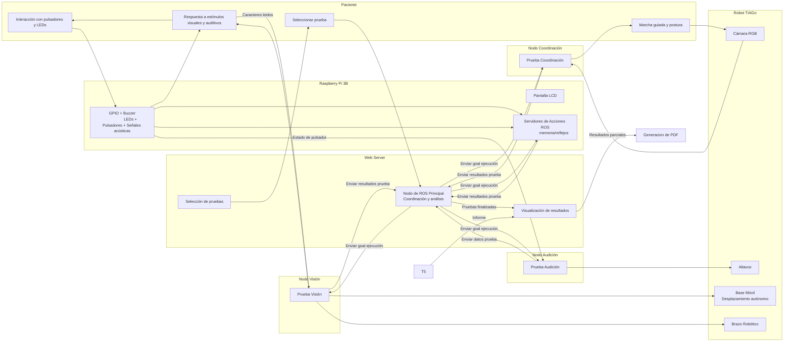

# Hito 2 – Diseño Conceptual del Sistema Robótico  
**Asignatura:** Robótica Aplicada a Servicios Biomédicos  
**Curso:** 2025–2026  
**Equipo:** PSICOTECNICO  
**Integrantes:**  
- Jon Camiruaga
- Daniel Gutierrez
- Ander Perez
- Asier Burgos

---

> **Índice**

- [1. Resumen del problema biomedico](#1-resumen-del-problema-biomedico)  
  - [1.1) Ámbito de evaluación](#11-ámbito-de-evaluación)  
  - [1.2) Descripción general del sistema](#12-descripción-general-del-sistema)  
  - [1.3) Justificación y valor biomédico](#13-justificación-y-valor-biomédico)  
  - [1.4) Requisitos funcionales](#14-requisitos-funcionales)  
  - [1.5) Capacidades técnicas](#15-capacidades-técnicas)  
  - [1.6) Resultado esperado](#16-resultado-esperado)  
- [2. Arquitectura del sistema](#2-arquitectura-del-sistema)  
  - [2.a) Diagrama general del sistema](#2a-diagrama-general-del-sistema-y-descripción-de-los-principales-módulos-funcionales)
  - [2.b) Especificación de componentes de hardware](#2b-especificación-de-componentes-de-hardware)  
  - [2.c) Esquema preliminar de interfaz de usuario (UIUX) y flujo de interacción con el sistema](#2c-esquema-preliminar-de-interfaz-de-usuario-uiux-y-flujo-de-interacción-con-el-sistema)  
- [3. Diseño de software y comunicación](#3-diseño-de-software-y-comunicación)  
  - [3.a) Arquitectura de nodos en ROS 1](#3a-arquitectura-de-nodos-en-ros-1-diagrama-de-topics-servicios-y-acciones)  
  - [3.b) Estructura del repositorio y principales packages o módulos](#3b-estructura-del-repositorio-y-principales-packages-o-módulos)  
  - [3.c) Descripción de posibles contenedores Docker y dependencias del entorno](#3c-descripción-de-posibles-contenedores-docker-y-dependencias-del-entorno)  
- [4. Análisis de viabilidad técnica](#4-análisis-de-viabilidad-técnica)  
  - [4.a) Identificación de posibles limitaciones técnicas](#4a-identificación-de-posibles-limitaciones-técnicas-alcance-precisión-tiempo-de-respuesta-compatibilidad)  
  - [4.b) Estrategia de mitigación y pruebas iniciales](#4b-estrategia-de-mitigación-y-pruebas-iniciales)  
- [5. Cronograma de desarrollo](#5-cronograma-de-desarrollo)  
  - [5.a) Plan temporal desde el Hito 3 hasta la entrega final](#5a-plan-temporal-desde-el-hito-3-hasta-la-entrega-final)  
  - [5.b) Reparto de responsabilidades actualizado](#5b-reparto-de-responsabilidades-actualizado-con-enfoque-colaborativo)  

---


## 1. Resumen del problema biomedico

> **Objetivo:** diseñar un sistema robótico con TIAGo que realice de forma automatizada una evaluación psicotécnica de capacidades sensoriales y motrices en un entorno clínico (similar a las pruebas para el carnet de conducir), generando un informe estandarizado a partir de datos objetivos.
> El sistema está orientado a la evaluación de personas que deben someterse a pruebas psicotécnicas, como aspirantes o renovadores del carnet de conducir, evaluaciones básicas de capacidades sensoriales o revisiones realizadas en centros autorizados.

### 1.1. Ámbito de evaluación
- Vista
- Oído
- Movimiento y coordinación
- Velocidad de reflejos
- Memoria a corto plazo

### 1.2. Descripción general del sistema
- **Rol de TIAGo**  
  Facilita y orquesta la sesión: presenta instrucciones por voz, guía al paciente y captura vídeo para prueba de coordinación.
- **Unidad auxiliar (Raspberry Pi 3B)**  
  Gestiona **pulsadores, LEDs, buzzer y pantalla LCD** para pruebas de **reflejos** y **memoria**.
- **Flujo básico**  
  El robot guía al paciente → se ejecutan las pruebas → se registran y procesan los datos → se genera un informe con resultados y métricas clave.
- **Restricción relevante**  
  Las pruebas de reflejos y memoria dependen de sensórica externa en la Raspberry Pi (TIAGo no dispone de esos periféricos de serie).

### 1.3. Justificación y valor biomédico
- **Precisión y estandarización**: protocolos reproducibles con control milimétrico del *timing* y registro automático.
- **Menor carga asistencial**: libera tiempo del personal sanitario para tareas de mayor valor.
- **Reducción de errores**: minimiza variabilidad inter-evaluador y sesgos humanos.
- **Mejor experiencia del paciente**: interacción guiada, consistente y potencialmente menos estresante.

> **Campo emergente**: la robótica clínica se ha centrado históricamente en rehabilitación/asistencia; su aplicación a evaluaciones psicotécnicas automatizadas aporta innovación y trazabilidad objetiva.

---

### 1.4. Requisitos funcionales

| Módulo | Descripción | Detalles operativos |
|---|---|---|
| **Test de Reflejos** | Pulsación de botón iluminado | Secuencias aleatorias, niveles crecientes (menos tiempo de respuesta)|
| **Test de Memoria (corto plazo)** | Repetición de secuencias de LEDs | Secuencias aleatorias, niveles crecientes (secuencias cada vez mas largas) |
| **Prueba de Vista** | Estímulos visuales | Presentación en pantalla/tabla; Diagnostico capacidad visual del paciente |
| **Prueba de Oído** | Estímulos auditivos (beeps) | Pitidos aleatorios en número y tiempo, respuesta del usuario |
| **Evaluación psicomotora** | Marcha y postura con cámara de TIAGo | Detección de desviaciones/cambios bruscos |
| **Interfaz gráfica** | Selección de pruebas y visualización de resultados | Facilita el feedback de ciertas pruebas del psicotecnico |

---

### 1.5. Capacidades técnicas

**Hardware**
- **Robot TIAGo**: base movil, cámara, altavoz y brazo robótico.
- **Raspberry Pi 3B**: panel de **pulsadores + LEDs**, **buzzer**, **Pantalla LCD** y conexión **I2C**/**GPIO** para estímulos y lectura de respuestas.

**Software**
- **ROS 1 Noetic** para comunicación y orquestación de nodos (TIAGo ↔ Raspberry Pi).
- **Python** para lógica de pruebas, manejo de GPIOs...
- **Visión por computador**: uso de OpenCV para análisis de postura y marcha.

---

### 1.6. Resultado esperado
- **Sesión guiada de pruebas** totalmente automatizada.
- **Métricas objetivas** por prueba (precisión, aciertos/fallos, estabilidad postural).
- **Informe estandarizado** con resultados y observaciones, listo para incorporar a historia clínica. Además del informe estandarizado, los resultados permiten orientar decisiones clínicas básicas. Más allá del apto / no apto, el sistema puede sugerir recomendaciones como la necesidad de una revisión oftalmológica.

## 2. Arquitectura del sistema

### 2.a) Diagrama general del sistema y descripción de los principales módulos funcionales
#### Diagrama general del sistema





#### Descripción de los principales módulos funcionales

### Paquete `rpi_pkg`

Este paquete agrupa todas las funcionalidades que se ejecutan de forma externa en la **Raspberry Pi 3B**. Su propósito principal es gestionar y ejecutar las pruebas psicotécnicas de reflejos y memoria a corto plazo.

**Arquitectura de Control:**
> La lógica de las pruebas (scripts de Python) reside en la Raspberry Pi. Un servidor de acciones ROS (`servidor_memoria.py`) se ejecuta en la Pi y espera peticiones. Desde el `web_server` principal, el usuario selecciona las pruebas a realizar. El `web_server` envía un *goal* (objetivo) al servidor de acciones, indicando qué pruebas ejecutar y en qué orden. El servidor de acciones se encarga de lanzar los scripts correspondientes (`reflejos.py`, etc.) cuando llega su turno.

---

###### 1. Prueba de Reflejos

**Script:** `reflejos.py`

**Descripción Funcional:**
Esta prueba evalúa la capacidad de reacción del paciente.

* **Estímulo:** El sistema enciende LEDs en pulsadores distribuidos de forma aleatoria.
* **Acción:** El paciente debe pulsar el botón correspondiente al LED que se ha encendido.
* **Evaluación:** Se mide la precisión de la respuesta.
* **Niveles:** Cuando el paciente supera un nivel, avanza al siguiente. En cada nuevo nivel, la velocidad a la que se encienden los LEDs es mayor, incrementando la dificultad.

**Implementación:**
* Este script es invocado por el servidor de acciones `servidor_memoria.py` cuando recibe la orden correspondiente desde el `web_server`.

---

###### 2. Prueba de Memoria a Corto Plazo

**Script:** 'memoria.py'

**Descripción Funcional:**
Esta prueba evalúa la capacidad de memoria a corto plazo del paciente.

* **Estímulo:** El sistema presenta una secuencia de LEDs que se encienden y apagan, uno tras otro, de forma aleatoria.
* **Acción:** El paciente debe repetir la secuencia, pulsando los botones en el mismo orden exacto en que se encendieron.
* **Evaluación:** El sistema valida si la secuencia introducida por el paciente es correcta.
* **Niveles:** Al superar un nivel, el paciente avanza al siguiente. En cada nuevo nivel, se añade un LED adicional a la secuencia, incrementando progresivamente la dificultad.

**Implementación:**
* Al igual que la prueba de reflejos, esta funcionalidad es gestionada e invocada por el servidor de acciones `servidor_memoria.py`.

---

###### 3. Utilería: Estado de Pulsador

**Script:** `estado_pulsador.py`

**Descripción:**
Este script no es una prueba psicotécnica, sino un nodo de utilidad que se ejecuta de forma independiente para dar soporte a *otros* módulos (como el módulo de audición).

* **Función:** Publica de forma constante en un *topic* de ROS el estado (pulsado/no pulsado) de un pulsador específico de la Raspberry Pi.
* **Caso de Uso:** Se utiliza en una de las pruebas del módulo de audición. En dicha prueba, el paciente debe presionar este pulsador específico en el momento en que escucha un pitido emitido por el robot TIAGO.
* **Ayuda Visual:** Para que el usuario pueda identificar fácilmente cuál de los 6 pulsadores de la Raspberry Pi debe utilizar para la prueba de audición, el LED asociado a ese pulsador se programa para que permanezca iluminado de forma fija durante toda la duración de esa prueba.

---

### Paquete `audicion_pkg`

Este paquete agrupa las funcionalidades relacionadas con la evaluación de la capacidad auditiva del paciente. A diferencia del paquete rpi_pkg, que gestiona LEDs y pulsadores para reflejos y memoria, este módulo coordina los pitidos generados por el TIAGo y la detección de pulsaciones de un pulsador recogidas desde la Raspberry Pi mediante el script estado_pulsador.py.

Su función principal es sincronizar estímulos acústicos emitidos por el robot con la respuesta física del usuario, registrando los tiempos de reacción y validando si la percepción auditiva es correcta.

**Arquitectura de Control:**
> El paquete audicion_pkg implementa un action server de ROS 1 que se ejecuta desde un ordenador central (script audicion_action.py). Este servidor hace uso de la información publicada por un nodo auxiliar en la Raspberry Pi, encargado de enviar continuamente el estado de un pulsador específico.
> El web_server actúa como cliente de acciones, enviando un goal al action server para iniciar la prueba de audición. El goal únicamente indica que debe ejecutarse la prueba completa (ambas subpruebas), mientras que el servidor se encarga de toda la ejecución interna.
> El servidor ejecuta una clase que implementa dos subpruebas auditivas diferentes (conteo de pitidos y tiempo de reaccion auditivo)
> Una vez finalizadas ambas subpruebas, el action server envía un result al nodo central (web server). Este resultado no es todavía la evaluación final, porque parte del análisis depende de una acción posterior del usuario.

---

###### 1. Subprueba 1 de audicion -- Conteo de pitidos

**Script:** integrado en el script 'prueba_audicion.py'
**Scripts auxiliares:** 'speaker.py'

**Descripción Funcional:**
Esta prueba evalúa la percepción auditiva básica y la capacidad de discriminación de estímulos, mediante el conteo de un número determinado de pitidos.

* **Estímulo:** El TIAGo genera una secuencia de pitidos con variación aleatoria tanto en el intervalo entre pitidos como en la cantidad total. El número real de pitidos es conocido por el sistema pero no por el usuario.
* **Acción:** Una vez finalizada, desde el web server, el usuario indica cuántos pitidos cree haber escuchado.
* **Evaluación:** El sistema registra el número total de pitidos emitidos, y luego lo envia junto a los datos de la otra subprueba al web server, para que este sea quien genere el resultado con la acción del usuario.

**Implementación:**
* 'audicion_action.py' registra cuántos pitidos se han de emitir, y manda al TIAGo a realizarlos mediante el la clase creada en el script 'speaker.py'.

---

###### 2. Subprueba 2 de audicion -- Tiempo de Reacción ante estimulos auditivos

**Script:** 'prueba2.py'
**Scripts auxiliares:** 'speaker.py'

**Descripción Funcional:**
Esta prueba evalúa el tiempo de reacción auditivo del usuario cuando se generan pitidos desde el altavoz del TIAGo.

* **Estímulo:** Pitidos emitidos mediante la ayuda del script 'speaker.py' a intervalos controlados o aleatorios.
* **Acción:** El usuario debe pulsar el botón iluminado en la Raspberry Pi en el momento en que escucha el pitido.
* **Evaluación:** El sistema registra si se pulsa el pulsador en todo momento, y permite registrar el número de aciertos (pulsación desde  que suena el pitido hasta 1 segundo despues) y el número de fallos debidos a una acción del usuario sin que haya habido pitido. Todo esto se envia al nodo central cuando finalize toda la prueba de audición.

**Implementación:**
* 'prueba2.py' registra cuántos pitidos se han de emitir, y manda al TIAGo a realizarlos mediante el la clase creada en el script 'speaker.py'. La coordinación completa de la prueba corresponde a prueba_audicion.py, que ejecuta esta subprueba cuando el web_server lo solicita y recoge sus resultados.

---

##### 3. Detalles adicionales sobre el *action server* y `speaker.py`

###### 3.1. Action server de ROS 1 (`audicion_action.py`)

El script `audicion_action.py` implementa un **action server de ROS 1** que actúa como controlador principal de la prueba de audición.

En nuestro caso, `audicion_action.py`:
* Recibe un **goal** desde el 'web server' (cliente de acciones) para iniciar la prueba de audición completa.
* Coordina internamente la ejecución de las **dos subpruebas** (conteo de pitidos y tiempo de reacción).
* Registra cuántos pitidos se han emitido en cada prueba y los aciertos/fallos en la subprueba de reacción.

Al terminar ambas subpruebas, el action server **no envía un veredicto final**, sino un **conjunto de datos**. La evaluación final depende también de la respuesta introducida por el usuario en el 'web server', por lo que el cálculo definitivo se hace en ese nodo central.

Además, hay creado en el propio paquete un cliente de acción ('cliente_action_audicion.py') por si se desea ejecutar este paquete por separado.

###### 3.2. Script `speaker.py` y su clase reutilizable

El archivo `speaker.py` contiene una **clase** para controlar el altavoz del TIAGo. Esta clase abstrae la lógica de salida de audio y ofrece métodos para:
* Generar **pitidos** con diferentes frecuencias, duraciones e intervalos.
* Reproducir **texto por voz**, permitiendo que TIAGo dé instrucciones habladas.

Gracias a esto:
- `audicion_action.py` puede centrarse en la lógica de la prueba, delegando en `speaker.py` todo lo relacionado con la generación de audio.
- La misma clase puede ser reutilizada desde **otros paquetes** del proyecto cuando se necesiten instrucciones habladas o señales acústicas adicionales, evitando duplicar código y facilitando el mantenimiento del sistema.

---

### Paquete 'mover_pkg'

Este paquete agrupa las funcionalidades relacionadas con el **movimiento de la base del robot TIAGo** dentro del entorno de evaluación psicotécnica.
Su objetivo principal es situar al robot en las posiciones adecuadas para cada prueba (vista, marcha/postura, audición, etc.) y garantizar que la interacción con el paciente se realiza desde una distancia y orientación seguras y cómodas. Proporciona una capa de abstracción sencilla para:
* Recibir una lista de checkpoints.
* Enviar los objetivos de navegación correspondientes al stack de movimiento de TIAGo.
* Confirmar si el robot ha ido alcanzando cada punto de la ruta.

**Arquitectura de Control:**
> El paquete `mover_pkg` implementa una **clase seguidora de checkpoints** (Follower) que recibe una lista de posiciones del mapa (waypoints)(solo posiciones x e y, y quaternios qz y qw) y las recorre en orden.
> La lógica de cuándo y a qué puntos debe ir TIAGo **no está dentro de `mover_pkg`**, sino en nodos externos (como el nodo central), que son quienes prepararan la lista de checkpoints y se la pasaran a esta clase cuando sea necesario.

---

**Funcionalidades del paquete**

Internamente, la clase se comunica con el sistema de navegación de TIAGo para enviar cada checkpoint como objetivo de navegación y esperar a que se alcance antes de pasar al siguiente. Además, el paquete incluye:
* Un **launch de RViz**, para visualizar el robot, el mapa y los objetivos de navegación en pruebas de validacion.
* Un **launch del mapa del laboratorio**, para cargar el entorno donde se moverá TIAGo.
 
Como herramienta de validación, `mover_pkg` incorpora también un script `.sh` que:
1. Lanza RViz.
2. Tras unos segundos, lanza el nodo del mapa.
3. Pasado un tiempo adicional, ordena al checkpoint follower que recorra una lista fija de 4 puntos del mapa del laboratorio.

Este script se utiliza solo para **pruebas internas**, con el objetivo de verificar que:
* El mapa se carga correctamente.
* La navegación hasta los checkpoints funciona como se espera.
* La clase de seguimiento de checkpoints se comporta de forma estable antes de integrarla con el nodo central.

---

**Script `checkpoint_follower.py`**

Este script implementa la clase 'Follower', responsable de enviar objetivos de navegación al nodo '/move_base' del robot TIAGo y comprobar que el robot comienza a desplazarse, y  se detiene correctamente en cada checkpoint.

La clase actúa como un **cliente ligero de navegación**, encapsulando toda la lógica necesaria para recorrer una lista de poses dentro del mapa. La clase se inicializa creando:
* un **publicador** a `/move_base/goal` para enviar objetivos de navegación
* un **suscriptor** a `/robot_pose` para recibir la pose actual del robot
* un mecanismo que **detecta inicio y fin de movimiento** para ver cuando termina de moverse la base

Una vez inicializado, la clase permite enviar una lista de puntos mediante la funcion 'enviar_puntos()', que recibe una lista de posiciones `[x, y, qz, qw]`, crea un `PoseStamped` para cada una y las envía secuencialmente. Este método permite que nodos externos indiquen una **ruta completa** sin preocuparse por la lógica interna de navegación.

---

### 2.b) Especificación de componentes de hardware

En este apartado se detallan los componentes físicos que formarán el sistema robótico de evaluación psicotécnica, distinguiendo entre el robot base TIAGo, la unidad auxiliar basada en Raspberry Pi y el resto de periféricos y sistemas de comunicación. Toda la arquitectura está pensada para poder desplegarse en un entorno clínico controlado.

#### Robot base

El robot principal del sistema es **TIAGo** (PAL Robotics), en la configuración disponible en el laboratorio:

- **Plataforma móvil sobre ruedas**: base para desplazarse de forma autónoma en un entorno interior controlado.
- **Computador interno**:
  - PC industrial integrado con soporte para **ROS 1**.
  - Conectividad de red (Ethernet/WiFi) para integrarse en la red del laboratorio.
- **Cabeza sensorizada**:
  - **Cámara RGB** integrada para:
    - Monitorización de la marcha y postura del paciente.
  - **Altavoz** integrado para:
    - Instrucciones habladas durante las pruebas.
    - Apoyar la prueba de audición junto con señales acústicas específicas.
- **Brazo robótico de 7 GDL**:
  - Apoyar la prueba de vision.
- **Sensórica de navegación**:
  - Láser/scan 2D y  cámara de profundidad para navegación segura en el entorno.
  - Sensores de seguridad (bumpers, E-stop de hardware).

TIAGo actúa como plataforma central de interacción con el paciente, guía la sesión, presenta instrucciones y coordina las diferentes pruebas psicotécnicas.

#### Unidad auxiliar de pruebas psicotécnicas (Raspberry Pi)

Para las pruebas de **reflejos** y **memoria a corto plazo** se utilizará una unidad dedicada basada en:

- **Raspberry Pi 3 Model B**
  - Sistema operativo Linux con soporte para ROS y librerías de control de GPIO.
  - Conectividad WiFi para comunicarse con el PC del TIAGo mediante ROS 1.


#### Sensores

Los sensores se agrupan en dos bloques: los integrados en TIAGo y los externos conectados a la Raspberry Pi.

**Sensores integrados en TIAGo**

| Tipo de sensor      | Ubicación           | Magnitud medida                         | Uso principal                                        |
|---------------------|---------------------|-----------------------------------------|------------------------------------------------------|
| Cámara RGB          | Cabeza del robot    | Imagen en color                         | Pruebas de postura/marcha/seguimiento      |
| Altavoz           | Cabeza del robot    | Señal acústica                          | Intrucciones durante pruebas y para pruebas de oído |
| Sensores de navegación | Base móvil      | Distancia/obstáculos, posición relativa | Navegación segura en el entorno de pruebas          |

**Sensores externos ligados a la Raspberry Pi**

| Tipo de sensor                | Conexión             | Magnitud medida              | Uso principal                              |
|-------------------------------|----------------------|------------------------------|--------------------------------------------|
| Panel pulsadores + LEDs integrados | GPIO digitales (entrada/salida) | Detectar pulsaciones y generar estímulos luminosos | Módulo integrado para pruebas de reacción y de memoria |
| Buzzer / zumbador | GPIO PWM/digital | Generar señales acústicas simples (beeps) | Estímulos auditivos y refuerzo del feedback en test de reacción y memoria |
| Pantalla LCD 16x2 | I2C             | Mostrar mensajes, instrucciones y resultados en tiempo real | Feedback visual al usuario durante las pruebas de memoria y reflejos |


#### Actuadores

Los actuadores incluyen tanto los del propio robot TIAGo como los elementos externos que generan estímulos para el paciente.

**Actuadores integrados en TIAGo**

| Actuador             | Función                                  | Uso en el proyecto                         |
|----------------------|-------------------------------------------|--------------------------------------------|
| Motores de la base   | Movimiento del robot en el entorno        | Posicionamiento del robot en la sala       |
| Motores del brazo    | Gestos y señalización                     | Señalar elementos o acompañar instrucciones |
| Altavoz              | Reproducción de audio e instrucciones     | Explicar pruebas, dar feedback al paciente  |

**Actuadores externos gestionados por la Raspberry Pi**

| Actuador              | Conexión       | Función                                          | Uso principal                                             |
|-----------------------|----------------|--------------------------------------------------|-----------------------------------------------------------|
| LEDs   | GPIO  | Estímulos luminosos individuales por pulsador | Test de reacción y test de memoria (secuencias de LEDs)   |
| Zumbador / Buzzer     | PWM | Señales acústicas simples (beeps)             | Estímulos auditivos adicionales y refuerzo del feedback   |
| PANTALLA LCD 16X2     | I2C | Muestra mensajes por pantalla           | Feedback al paciente mientras realiza las pruebas de reflejos y memoria   |


#### Periféricos y sistemas de comunicación

Para completar el sistema se consideran los siguientes periféricos y enlaces de comunicación:

**Periféricos**

- **Tablet/Movil**:
  - Acceso a la interfaz gráfica de control (panel para iniciar pruebas, ver resultados y dar feedback).

**Sistemas de comunicación**

- **Red local del laboratorio (LAN/WiFi)**:
  - Interconexión entre:
    - PC interno de TIAGo (nodos ROS 1 principales).
    - Raspberry Pi 3B.
    - Tablet del evaluador (interfaz de usuario y herramientas de supervisión).
- **Protocolo de comunicación de alto nivel**:
  - ROS 1 para intercambio de mensajes entre nodos distribuidos en TIAGo, Raspberry Pi y PC externo.
- **Acceso remoto y administración**:
  - Conexiones SSH a la Raspberry Pi para despliegue, mantenimiento y depuración de nodos.

En conjunto, esta configuración de hardware garantiza que el sistema pueda:
1. Interactuar de forma natural con el paciente (TIAGo).
2. Generar y medir estímulos de reacción/memoria con precisión (Raspberry Pi + LEDs + pulsadores + buzzer + Pantalla LED).
3. Integrarse en la infraestructura de red del laboratorio, manteniendo la modularidad y escalabilidad necesarias para futuras extensiones.

### 2.c) Esquema preliminar de interfaz de usuario (UI/UX) y flujo de interacción con el sistema

## 3. Diseño de software y comunicación
### 3.a) Arquitectura de nodos en ROS 1 (diagrama de topics, servicios y acciones).
### 3.b) Estructura del repositorio y principales packages o módulos

El proyecto se organiza en torno a un repositorio Git que incluye, por un lado, la configuración general (Docker, requirements, scripts) y, por otro, el workspace de ROS 1 con todos los paquetes del sistema psicotécnico.

#### Árbol general del repositorio

```text
psicotecnico/
├─ README.md
├─ Dockerfile
├─ docker-compose.yml
├─ requirements_rpi.txt
├─ pswd_tiago
├─ tutorial_docker.txt
└─ carpeta_compartida/
   ├─ setup_env.sh
   ├─ examples/
   └─ psico_ws/
      ├─ .catkin_workspace
      ├─ build/             
      ├─ devel/
      ├─ logs/        
      └─ src/
         ├─ audicion_pkg/
         ├─ coordinacion_pkg/
         ├─ face_recognition_pkg/
         ├─ mover_pkg/
         ├─ rpi_pkg/
         ├─ vision_pkg/
         └─ web_server_pkg/
```
Ficheros raíz (Dockerfile, docker-compose.yml, requirements_rpi.txt…)
  Definen el entorno de desarrollo y ejecución (dependencias de Python para la Raspberry Pi, configuración de Docker, scripts de ayuda para despliegue y uso del repositorio).

carpeta_compartida/
  Directorio que contiene el workspace completo de ROS 1 (psico_ws) junto con materiales auxiliares:
  - setup_env.sh: script para configurar el entorno (sourcing de ROS y del workspace).
  - notas: apuntes internos del proyecto.
  - examples/: ejemplos de referencia usados al inicio del desarrollo.
  - psico_ws/: workspace catkin donde residen todos los paquetes del sistema psicotécnico.
------------------------------------------------------------
Estructura interna de los paquetes de ROS
------------------------------------------------------------
Dentro de psico_ws/src/ todos los paquetes de ROS 1 comparten la misma estructura típica de un paquete catkin. 
Descripción de cada elemento:

action/
  Carpeta donde se definen los ficheros .action usados por ROS.
  Aquí se describen las acciones asociadas a las pruebas psicotécnicas (memoria, reflejos, etc.), indicando:
  - Datos de entrada de la acción (goal).
  - Información de feedback durante la ejecución.
  - Resultado final (result).

include/rpi_pkg/
  Directorio reservado para cabeceras C++ o interfaces compartidas.
  Aunque la lógica principal del proyecto está en Python, mantener este directorio:
  - Permite añadir nodos C++ en el futuro si se requiere más rendimiento.
  - Unifica la estructura entre todos los paquetes.

launch/
  Contiene los ficheros .launch que permiten arrancar uno o varios nodos a la vez.
  Desde aquí se definen, por ejemplo:
  - Lanzar el servidor de coordinación junto con los nodos de la Raspberry Pi.
  - Configurar parámetros iniciales de las pruebas (tiempos, niveles de dificultad, etc.).

src/rpi_pkg/
  Carpeta con el código fuente de los nodos del paquete (Python o C++).
  En este directorio se implementa la lógica de cada módulo. Ejemplos:
  - En rpi_pkg: control de GPIO, LEDs, pulsadores, buzzer y pantalla LCD I2C; cálculo de tiempos de reacción y puntuaciones.
  - En audicion_pkg: generación de pitidos y conteo de aciertos/fallos.

CMakeLists.txt
  Fichero de configuración de compilación e instalación del paquete.
  Indica a catkin:
  - Dependencias de otros paquetes de ROS o librerías externas.
  - Qué nodos se compilan.
  - Qué scripts Python se instalan como ejecutables.

package.xml
  Fichero de metadatos del paquete: nombre, versión, autores, licencias y dependencias de compilación/ejecución.
  Gracias a este archivo, el workspace se puede resolver y compilar correctamente con catkin build.

setup.py
  Script de instalación para los nodos Python.
  Permite que los scripts situados en src/rpi_pkg/ se instalen como ejecutables y puedan lanzarse directamente con rosrun o desde los ficheros .launch.

En resumen, esta estructura uniforme en todos los paquetes (audicion_pkg, vision_pkg, rpi_pkg, coordinacion_pkg, web_server_pkg, etc.) facilita:
  - Localizar rápidamente la lógica de cada prueba o módulo.
  - Trabajar en equipo sin confusiones sobre dónde va cada cosa.
  - Extender el sistema con nuevos nodos o acciones manteniendo siempre el mismo patrón de organización.
    
### Estructura Paquete rpi_pkg:
```text
psico_ws/src/rpi_pkg/
├── action/
│   ├── Memoria.action
│   └── Reflejos.action
├── include/
│   └─ rpi_pkg/
├── launch/
├── src/
│   └── rpi_pkg/
│       ├── estado_pulsador.py
│       ├── grove_rgb_lcd.py
│       ├── memoria.py
│       ├── reflejos.py
│       ├── servidor_memoria.py
│       └── servidor_reflejos.py
├── CMakeLists.txt
├── package.xml
└── setup.py
```
### Estructura Paquete audicion_pkg:
```text
psico_ws/src/audicion_pkg/
├── action/
│   ├── Audicion.action
├── include/
│   └── audicion_pkg/
├── launch/
├── src/
│   └── audicion_pkg/
│       ├── __init__.py
│       ├── audicion_action.py
│       ├── cliente_action_audicion.py
│       ├── notasIMPORTANTES.txt
│       ├── prueba2.py
│       ├── pruba_audicion.py
│       └── speaker.py
├── CMakeLists.txt
├── package.xml
└── setup.py
```
### Estructura Paquete coordinacion_pkg:
```text
psico_ws/src/coordinacion_pkg/
├── action
│   └── MobilityExam.action
├── CMakeLists.txt
├── include
│   └── coordinacion_pkg
├── launch
│   └── mobility_exam_server.launch
├── package.xml
├── setup.py
└── src
    └── coordinacion_pkg
        ├── cliente_action_mobility.py
        ├── holistic_cam.py
        ├── holistic_ros_cam.py
        ├── mobility_exam_30s.py
        ├── mobility_exam_action_server.py
        ├── mobility_exam.py
        ├── mobility_metrics_20251106-153814.csv
        ├── mobility_report_20251106-153814.txt
        ├── pruebas
        │   ├── captures
        │   │   ├── frame_20251009_164134_135075_0000.png
        │   │   └── frame_20251009_164148_978871_0000.png
        │   ├── ros_image_view_qt_buffered.py
        │   ├── ros_image_view_qt_live.py
        │   └── save_image_from_topic.py
        └── speak_api.py
```
### Estructura Paquete face_recognition_pkg:
```text
psico_ws/src/face_recognition_pkg/
├── action
│   └── FaceRecognition.action
├── CMakeLists.txt
├── include
│   └── face_recognition_pkg
├── launch
├── package.xml
├── setup.py
└── src
    └── face_recognition_pkg
        ├── cliente_action_face.py
        ├── enroll_user.py
        ├── __init__.py
        ├── recognize_action_server.py
        ├── recognize.py
        ├── recognize_ros.py
        ├── requirements_noetic_py38.txt
        └── requirements.txt
```
### Estructura Paquete mover_pkg:
```text
psico_ws/src/mover_pkg/
├── CMakeLists.txt
├── configs
│   └── rviz_configs.rviz
├── include
│   └── mover_pkg
├── launch
│   └── rviz.launch
├── maps
│   ├── Mapa_aula_mod_1.0.pgm
│   └── Mapa_aula_mod_1.0.yaml
├── notas.txt
├── package.xml
├── scripts
│   └── run_all.sh
└── src
    └── mover_pkg
        └── checkpoint_follower.py
```
### Estructura Paquete vision_pkg:
```text
psico_ws/src/vision_pkg/
├── CMakeLists.txt
├── include
│   └── vision_pkg
├── launch
├── package.xml
├── setup.py
└── src
    └── vision_pkg
        ├── moverbrazotiago.py
        ├── posibrazotiago.py
        ├── pruebavision.py
        ├── servidor_vision
        └── sources.txt
```
### Estructura Paquete web_server_pkg:
```text
psico_ws/src/web_server_pkg/
├── CMakeLists.txt
├── include
│   └── web_server_pkg
├── launch
├── package.xml
├── setup.py
└── src
    └── web_server_pkg
        ├── ApiPrototipo.py
        ├── app.py
        ├── checkpoint_follower_api.py
        ├── data
        │   └── history.csv
        ├── face_login_client.py
        ├── notas.txt
        ├── pruebas_client.py
        ├── __pycache__
        │   ├── pruebas_client.cpython-38.pyc
        │   ├── report.cpython-38.pyc
        │   └── speak_api.cpython-38.pyc
        ├── report.py
        ├── speak_api.py
        ├── static
        │   ├── css
        │   │   ├── app.css
        │   │   └── index.css
        │   ├── img
        │   │   └── logo-deusto.png
        │   └── js
        │       ├── admin.js
        │       ├── index.js
        │       └── login.js
        └── templates
            ├── admin_index.html
            ├── index.html
            ├── indexPrototipo.html
            └── login.html
```
---

###  3.c) Descripción de posibles contenedores Docker y dependencias del entorno.

## 4. Análisis de viabilidad técnica

> **Objetivo:** identificar las principales **limitaciones técnicas** del sistema (alcance, precisión, tiempo de respuesta y compatibilidad) y definir una **estrategia de mitigación** y **pruebas iniciales** para validarlo en el entorno real.

### 4.a) Identificación de posibles limitaciones técnicas (alcance, precisión, tiempo de respuesta, compatibilidad).
#### En cuanto a la Raspberry pi 3B:
- Limitaciones de rendimiento en la Raspberry Pi 3B con Docker:
Inicialmente se planteó ejecutar el nodo de ROS 1 de la Raspberry dentro de un contenedor Docker, con la idea de aislar dependencias y facilitar la reproducibilidad del entorno. En la práctica, la combinación Raspberry Pi 3B + Docker + ROS 1 ha resultado muy exigente a nivel computacional.
La Pi 3B, con CPU y memoria limitadas, mostraba lentitud general del sistema, mayor tiempo de arranque de los contenedores y pequeños retardos en la ejecución de los nodos, lo que afecta directamente al tiempo de respuesta de la prueba de reflejos (encendido de LEDs y lectura de pulsadores).
- Problemas de acceso a los GPIO desde el contenedor:
Aunque se consiguió establecer comunicación con la Raspberry a través del contenedor, aparecieron problemas persistentes para acceder a los pines GPIO desde Docker.
En concreto:
  - Dificultades con el mapeo de dispositivos y directorios del sistema (/dev, /sys, etc.) dentro del contenedor.

  - Inconsistencias en el mapeo de los pines físicos a los números de GPIO empleados por las librerías de control, que impedían un funcionamiento fiable de los LEDs y pulsadores.

  - Riesgo de que pequeños cambios en la configuración del contenedor rompieran el acceso a los pines, comprometiendo la fiabilidad de la prueba.
- Compatibilidad del sistema operativo con ROS 1:
La Raspberry estaba originalmente configurada con Raspberry Pi OS (Debian). Aunque es posible ejecutar ROS 1 sobre esta plataforma, la integración con Docker y la disponibilidad de paquetes precompilados para ROS 1 en esta arquitectura complicaban la instalación y el mantenimiento del entorno.
Esto introducía una limitación de compatibilidad que aumentaba el riesgo de errores, especialmente al trabajar con versiones y dependencias específicas para TIAGO.

En conjunto, estas limitaciones hacían que la solución basada en Docker sobre Raspberry Pi 3B no fuera suficientemente robusta ni determinista para un sistema psicotécnico que debe medir tiempos de reacción con cierta precisión y ofrecer un comportamiento estable durante las pruebas.

### En cuanto al paquete `mover_pkg` (navegación del TIAGo):


---

### 4.b) Estrategia de mitigación y pruebas iniciales.
#### En cuanto a la Raspberry pi 3B:
Para mitigar los problemas detectados y asegurar la viabilidad técnica del sistema, se ha optado por simplificar la arquitectura en la Raspberry Pi 3B, renunciando al uso de Docker en este dispositivo y pasando a una instalación nativa de ROS 1:
- Eliminación de Docker en la Raspberry Pi:
Aunque ya se disponía de un Dockerfile y de la infraestructura preparada para ejecutar ROS 1 dentro de un contenedor, se ha tomado la decisión de retirar todo lo relacionado con Docker en la Raspberry.
De este modo:
  - Se eliminan las capas de abstracción que dificultaban el acceso a los GPIO.
  - Se reduce la carga computacional sobre la Pi 3B, mejorando su tiempo de respuesta y la fluidez de ejecución de los nodos.
- Cambio de sistema operativo e instalación directa de ROS 1
Como parte de la estrategia de mitigación, se ha reinstalado por completo el sistema operativo de la Raspberry Pi 3B:
  - Se ha sustituido Raspberry Pi OS (Debian) por Ubuntu 20.04, distribución mejor soportada por ROS 1 Noetic.
  - Sobre Ubuntu 20.04 se ha instalado ROS 1 de forma nativa, sin contenedores, y se ha configurado un workspace específico para el paquete rpi_pkg y el resto de nodos de la prueba de reflejos.
- Resultados de las pruebas iniciales en el entorno real:
Tras esta reconfiguración se han realizado pruebas de integración con el robot TIAGO y con el hardware de la prueba psicotécnica:
  - La Raspberry Pi accede ahora directamente a los pines GPIO, sin problemas de mapeo ni de permisos, utilizando las librerías previstas para LEDs y pulsadores.
  - Se han comprobado tiempos de encendido de LEDs y detección de pulsaciones consistentes y sin retardos apreciables, adecuados para la evaluación de reflejos.
  - La comunicación entre la Raspberry y TIAGO mediante ROS 1 se ha estabilizado, pudiendo lanzar las pruebas desde TIAGO y recibir los resultados sin incidencias.
- Impacto en la escalabilidad y justificación de la decisión:
Es cierto que renunciar a Docker en la Raspberry Pi reduce la portabilidad y la escalabilidad futura del proyecto (por ejemplo, sería más complejo replicar exactamente el entorno en otra Raspberry o migrar a otro hardware sin rehacer parte de la instalación).
Sin embargo, para el alcance actual del proyecto, priorizar:
  - La fiabilidad en tiempo real
  - La precisión de las medidas de reacción
  - La simplicidad de mantenimiento: resulta más crítico que disponer de un entorno completamente contenedorizado.
## 5. Cronograma de desarrollo
### 5.a) Plan temporal desde el Hito 3 hasta la entrega final
### 5.b) Reparto de responsabilidades actualizado, con enfoque colaborativo.

